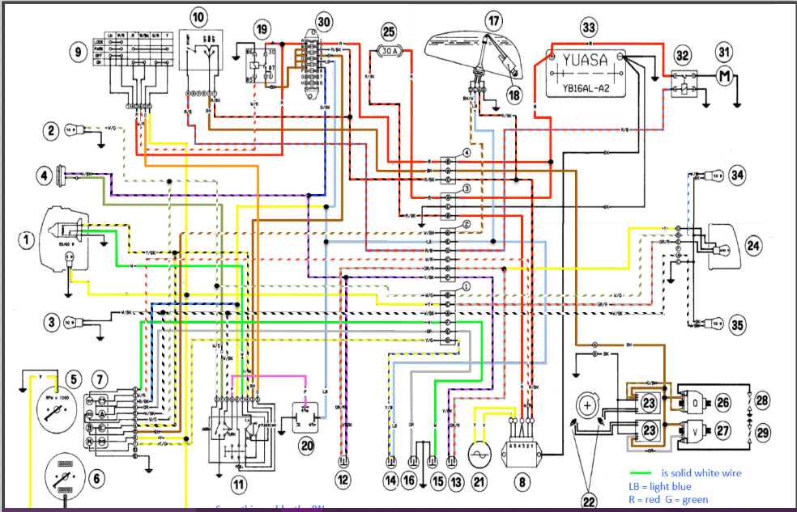

# 電装系(主に点火系)配線に関するドメイン知識 — Ducati 900SS (1995年式)

## コンポーネント一覧

| No. | Component                             |
|-----|---------------------------------------|
| 1   | Headlight                             |
| 2   | Front, right turn indicator           |
| 3   | Front, left turn indicator            |
| 4   | Horn                                  |
| 5   | Rev counter                           |
| 6   | Speedometer (km/h)            |
| 7   | Dashboard warning lights (12V-1.2W)   |
| 8   | Regulator-Rectifier                   |
| 9   | Ignition switch                       |
| 10  | R.H. grip switch                      |
| 11  | L.H. grip switch                      |
| 12  | Front stop light switch               |
| 13  | Rear stop light switch                |
| 14  | Neutral indicator / safety bypass switch |
| 15  | Oil pressure sending unit             |
| 16  | Side stand switch                     |
| 17  | Fuel level gauge                      |
| 18  | Fuel pump                             |
| 19  | Main Relay                            |
| 20  | Turn flasher relay                    |
| 21  | Alternator                            |
| 22a | Pick-up — horizontal cylinder         |
| 22b | Pick-up — vertical cylinder           |
| 23  | Ignition module (IDS)                 |
| 24  | Tail light                            |
| 25  | Fuse holder 30A (main)                |
| 26  | Coil — horizontal cylinder            |
| 27  | Coil — vertical cylinder              |
| 28  | Spark plug — horizontal cylinder      |
| 29  | Spark plug — vertical cylinder        |
| 30  | Fuse box                              |
| 31  | Starter motor                         |
| 32  | Starter relay (remote switch)         |
| 33  | Battery (YUASA YB16AL-A2)             |
| 34  | Rear, right turn indicator            |
| 35  | Rear, left turn indicator             |

---

## 回路図

### 1. 既存の点火系回路

```
IGNITION SWITCH (9)
     |
     | （電源供給）
     v
IGNITION MODULE / IDS (23) <-------- PICK-UP — Horizontal cylinder (22a)
     |                          <---- PICK-UP — Vertical cylinder   (22b)
     |                                  [タイミング信号（各気筒独立）]
     |
     |--- COIL — Horizontal cylinder (26) ---> SPARK PLUG Horizontal (28)
     |
     `--- COIL — Vertical cylinder   (27) ---> SPARK PLUG Vertical   (29)
```

> **クイックシフター接続ポイント:**
> - **RPM信号タップ:** PICK-UP (22a または 22b) → IGNITION MODULE 間の信号線に割り込む。または IGNITION MODULE → REV COUNTER (5) 間のタコメーター信号線から取得する方が安全（信号レベルが安定している）。いずれもArduinoの5V入力に対してレベル変換回路が必要（`docs/domain/common.md` セクション4参照）。
> - **点火カット介入点:** COIL 水平 (26) および 垂直 (27) の一次側（LV側, 0.34 Ω）への電流遮断で実現する。ArduinoのOUTPUT端子でNチャンネルMOSFETをスイッチング、またはリレーを制御してコイルの一次電源ラインを断続する。`ignition.md` のカット時間設計（30〜120 ms）を参照。

---

### 2. クイックシフター実装後の点火系回路 (検討中)


```
【電源供給】
Battery (3) ------> リレー --------> Arduino nano
                     ↑ 
                  ACC電源 (トリガ)

【RPM取得】
PICK-UP — Horizontal cylinder (22a) ------> フォトカプラ/シュミットトリガ ------> Arduino nano (D2)
PICK-UP — Vertical cylinder (22b) ------> フォトカプラ/シュミットトリガ ------> Arduino nano (D3)

【各センサーの状態取得】
シフトロッドセンサー --------------------------------------------> Arduino nano (D4)
                                               |---------------> Arduino nano (GND)
クラッチセンサー -----------------------------------------------> Arduino nano (D5)
                                               |---------------> Arduino nano (GND)

【点火カット出力】
ピックアップコイル --------------------------------------> アース (GND)
                                 ↑ 
                      MOSFET / フォトモスリレー
                                 ↑ (最終的なoutput)
                           Arduino nano
```
---
## 注意事項

