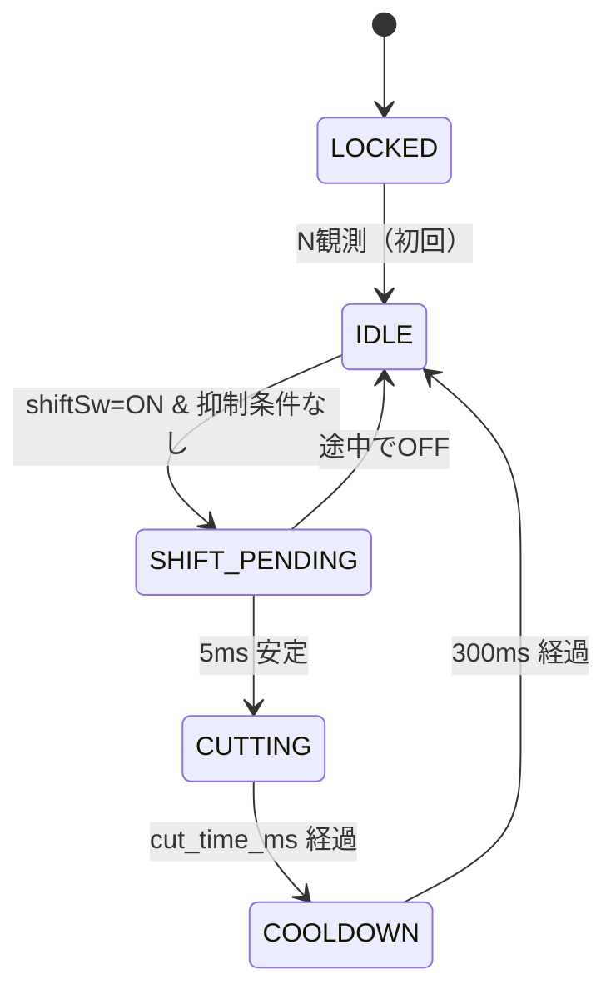

# 02. アーキテクチャ・ステートマシン

ファイル構成・層間依存・`config.h` の全体像、および `shifter` モジュールが持つステートマシン定義。

---

## 1. ファイル構成（4層）

`.ino` は orchestrator のみ。

```
quick-shifter-with-claude-code.ino   ← setup() / loop() のみ
src/
  config.h          ← 全定数（ピン参照/閾値/タイミング/DEBUG）
  sensors.h/.cpp    ← 入力層: rpm測定(割込)、各SWのデバウンス
  gear_logic.h/.cpp ← 計算層: 現在ギア管理、cut_time_ms 算出、許可rpmレンジ判定
  shifter.h/.cpp    ← 出力層: ステートマシン、点火カット出力、状態LED制御
  debug.h           ← DEBUG_MODE 切替ロギングマクロ
```

### 層間の依存規則
- `sensors` → ハードウェア（ピン・割込）のみに依存
- `gear_logic` → `sensors` と `config.h`
- `shifter` → `sensors`・`gear_logic`・`config.h`
- `.ino` → 上記の `init()` / `update()` を呼ぶのみ

### 主要状態変数の所有モジュール

| 変数 | 所有 | アクセス API |
|---|---|---|
| `currentGear` (`uint8_t`, 0..6) | `gear_logic` | `getCurrentGear()` で読み取り、`notifyShiftCompleted()` で `shifter` から QS シフト完了を通知（内部で `currentGear++`）。N押下/離脱エッジ判定とそれに伴うカウンタ更新も `gear_logic` 内で完結 |
| `state` (ステートマシン) | `shifter` | 外部公開不要（`shifter::update()` 内で閉じる） |
| rpm 周期サンプル | `sensors` | `getRPM()` / `isRpmSignalAlive()` 経由でのみアクセス |

### ピン定義の単一の真実源

ピン番号・極性・入出力方向の正本は `docs/arduino/pin_assign.md`。`config.h` はその値を写すのみ。[05-hardware-scope-tuning.md](./05-hardware-scope-tuning.md) §ハードウェア要件 は pin_assign.md への差分のみ記述する。

## 2. `config.h` の全体像

```cpp
// ───── ピン定義（正本: docs/arduino/pin_assign.md） ─────
// 入力スイッチはすべてアクティブLOW（INPUT_PULLUP）
//   D5 シフトロッドSW   : 踏み込み = LOW（上方向プッシュ時のみ ON、docs/implementation/05-hardware-scope-tuning.md §1.3 要確認）
//   D6 クラッチSW       : 油圧上昇 = LOW (DRC F5945)
//   D4 ニュートラルSW   : N位置   = LOW
// 出力はアクティブHIGH（docs/implementation/04-safety.md §2）
//   D8 点火カット出力   : HIGH = カット
//   D7 状態LED          : HIGH = 点灯
#define PIN_RPM_PULSE     3   // INT1 (Nano)
#define PIN_SHIFT_SW      5
#define PIN_CLUTCH_SW     6
#define PIN_NEUTRAL_SW    4
#define PIN_CUT_OUTPUT    8
#define PIN_STATUS_LED    7

// rpm
#define QS_RPM_MIN        3000
#define QS_RPM_MAX        8500
#define RPM_AVG_SAMPLES   4    // 2のべき乗
#define RPM_TIMEOUT_MS    100

// カット時間
#define MIN_CUT_MS        40
#define MAX_CUT_MS        120
// 1→2, 2→3, 3→4, 4→5, 5→6 の遷移に対応。gear (1..5) から REVS_REQUIRED_X10[gear-1]。
// revs_required を ×10 して整数化（AVR の浮動小数を回避）。
const uint16_t REVS_REQUIRED_X10[5] = { 80, 70, 60, 50, 45 };

// タイミング
#define SHIFT_DEBOUNCE_MS    5
#define SWITCH_DEBOUNCE_MS   20    // クラッチ・N用
#define COOLDOWN_MS          300

// デバッグ
#define DEBUG_MODE             // 本番ビルドではコメントアウト
```

## 3. ステートマシン

`shifter` モジュール内の **5状態の有限状態機械**。`回路設計.md` の要請（`delay()` 禁止・`millis()`/`micros()` ベース）に従い、全遷移は時刻比較で行う。

ERROR は **状態として持たない**。表示（LED）レベルでのみ表現する派生情報とする（[04-safety.md](./04-safety.md) §LED表示）。



### 抑制条件（IDLE→SHIFT_PENDING を阻止、SHIFT_PENDING→CUTTING でも再評価）

- クラッチ ON
- rpm < `QS_RPM_MIN` または rpm > `QS_RPM_MAX`
- rpm 信号タイムアウト（直近 `RPM_TIMEOUT_MS` にパルスなし）
- `currentGear == 0`（N。シフトSWは上方向専用のためN中の押下は想定外）
- `currentGear == 6`（6速で頭打ち）

5ms のデバウンス期間中に rpm が上限を超える等で条件成立する可能性があるため、**SHIFT_PENDING → CUTTING 遷移時にも同じ抑制条件を再評価する**（条件不成立なら IDLE に戻す）。実装上は判定関数 `isQsAllowed()` を `gear_logic` 層に1つ作り、両遷移で呼ぶ。

### LOCKED への復帰経路

本実装では LOCKED への復帰は行わない。一度 N を観測したら、以降は走行中の異常は IDLE 側で表示・抑制で処理する。Arduino リセット時のみ再 LOCKED となる。

### 遷移中のセンサー処理

SHIFT_PENDING / CUTTING / COOLDOWN 状態でも N・クラッチ状態は読み続け、ギアカウンタは [01-control-strategy.md](./01-control-strategy.md) §ギアカウンタの更新ルール のとおり更新する。新規シフトイベントは COOLDOWN 完了まで受け付けない。
