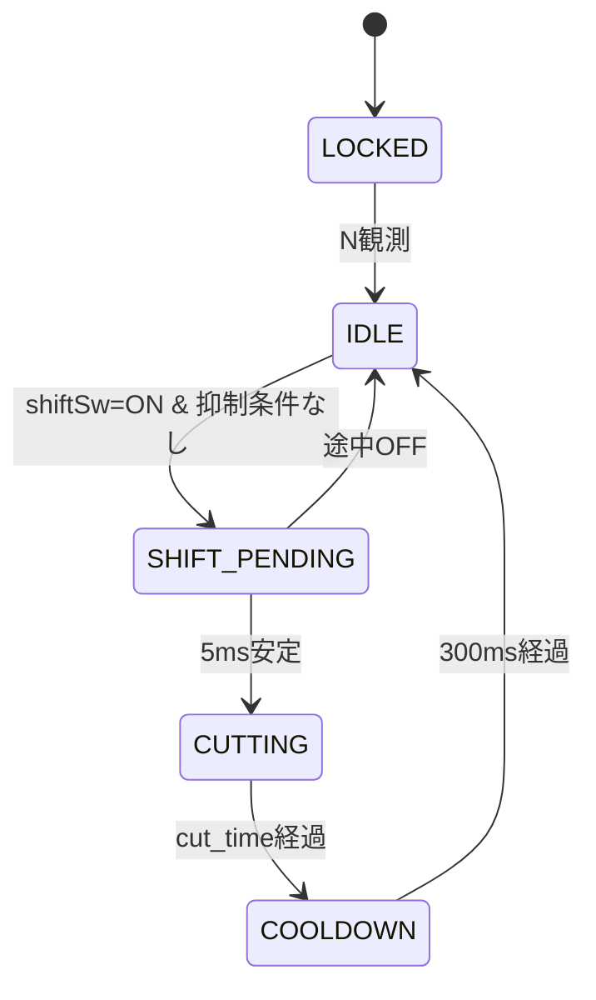

# 実装方針レビュー指摘 — `docs/実装方針検討.md`

レビュー対象：`docs/実装方針検討.md`
参照ドキュメント：`docs/domain/*.md`、`docs/回路設計.md`、`docs/arduino/pin_assign.md`
観点：バグ・冗長性・機能性・メンテナンス性

総評：制御モデル（rpm × ギア比による動的カット時間）、フェイルセーフ方向（アクティブHIGH）、4層アーキテクチャ、ステートマシン分割はいずれも筋が良い。一方で **コンパイル不能なコード片**、**ドメイン文書との数値整合性**、**ピン極性・電気的前提の記述抜け** といった、実装着手前に確定すべき欠落が複数ある。以下、優先度別に列挙する。

---

## 🔴 重大（実装着手前に修正必須）

### R-1. `Serial.printf` は AVR/Arduino Nano では使えない（§3.5）

```cpp
Serial.printf(fmt "\n", ##__VA_ARGS__);   // ← AVR Arduino では未定義
```

`HardwareSerial`（AVR コア）に `printf` メンバは存在しない。`avr-libc` の `printf` を `Serial` に接続するには `fdevopen` 等の小細工が必要で、しかも float サポートが切られている。

**対応案：**
- `snprintf` で一時バッファに整形 → `Serial.print` で出す方式に書き換える
- または `Print` 派生クラスを作って `printf` 風ヘルパを自作
- 簡便には `DBG_EVENT(tag, val1, val2)` のように引数固定マクロにして連結 `print` する

`DEBUG_MODE` 有効化時にビルドが通らないと、チューニング段階（§6）が成立しない。設計の根幹に関わるので最優先。

---

### R-2. RPM パルスレートの前提が `ignition.md` と不整合（§3.3.1）

実装方針 §3.3.1：
> パルスレート：**1パルス／クランク1回転**

しかし `docs/domain/ignition.md` §2 では：
> 90° V型2気筒エンジンのため、クランク1回転で2パルス（各気筒TDC前の固定角度でトリガー）が出力されると考えられる
> **パルス間隔は…Lツイン構造により不等間隔**

つまり「各気筒に独立ピックアップ（22a / 22b）があり、合計でクランク1回転に2発、しかも90度Vツインゆえ不等間隔」というのがドメインの推定。実装方針が片側ピックアップのみをタップする前提なら「1パルス/回転・等間隔」で正しいが、`回路設計.md` の入力源も「ピックアップコイル（R）」と単独表記であり、**片側タップであることを§3.3.1 で明示するのと同時に、`ignition.md` 側にもその含意を補足**しないと、後工程で前提が揺れる。

加えて以下を明文化すべき：
- 片側のみタップする根拠（不等間隔回避＋実装簡略化）
- 「ピックアップ → IDS（純正点火モジュール）」間に割り込む形であり、ピックアップ → IDS の元信号は維持される（並列読み取り）こと

> 実機検証：純正タコメーター信号（IDS → REV COUNTER, `wiring.md` (5)）から取る選択肢も §3.3.1 で残してよい。タコ信号はパルス整形済みで安定。`wiring.md` の脚注でも「タコメーター信号線から取得する方が安全」と推奨されている。

---

### R-3. ピン極性と `INPUT_PULLUP` の取り扱いが文書間で不一致

- §3.4.1：シフトSW は `INPUT_PULLUP` 受け（押下=LOW）
- §5.1 のピン表：D4/D7 のみ追記。D5/D6 の `INPUT_PULLUP` 化が明示されていない
- `docs/arduino/pin_assign.md`：全入力ピンの極性・プルアップ要否が空欄

クラッチセンサー（DRC F5945 油圧スイッチ）は「**油圧上昇でON＝クラッチを握ったとき LOW**」、シフトセンサー（ヤマハ 13S-82470-00）は「**踏み込みで ON ＝ LOW**」、ニュートラルスイッチは「**N で ON ＝ LOW**」と、すべてアクティブLOWで揃うはず。これを `config.h` 冒頭にコメントで一覧化し、`pin_assign.md` にも反映すること。

**修正提案（`config.h`）：**
```cpp
// すべての入力スイッチはアクティブLOW (INPUT_PULLUP 前提)
// - D5 シフト  : 踏み込み = LOW
// - D6 クラッチ: 油圧上昇 = LOW (DRC F5945)
// - D4 ニュートラル: N位置 = LOW
```

---

### R-4. ピン D5（シフトロッドセンサー）が `pin_assign.md` 既定と矛盾している箇所がある

`docs/domain/sensors.md` §1：
> 1つの配線をArduinoのデジタルピン([D5](../pin_assign.md))。もう一方をArduinoのGNDに接続予定

しかし同 §2（クラッチ）：
> 1つの配線をArduinoのデジタルピン([D6](../pin_assign.md))

`pin_assign.md` 上は D5=シフト / D6=クラッチで整合しており、実装方針もこれを踏襲している。ただしピンアサイン正本が `pin_assign.md` であることを §3.1（`config.h` 説明）で明示し、`sensors.md` 内のリンクが pin_assign の該当行へ確実に飛ぶ運用にしないと、将来ピンを動かしたときに容易に齟齬が出る。**単一の真実源を pin_assign.md に集約**し、実装方針 §5.1 は差分のみ示す形に整理されたい。

---

### R-5. ステートマシンに「ERROR」状態が事実上ない（§3.2／§4.1）

- §4.1：「速い点滅(5Hz) = ERROR（rpm信号断・rpm異常など）」と LED 仕様には ERROR がある
- §3.2 のステートマシン図には ERROR 状態が存在しない（5状態：LOCKED/IDLE/SHIFT_PENDING/CUTTING/COOLDOWN）

実装段階で「LEDだけ ERROR を表現する裏変数」が混入し、ステートマシンの一意性が崩れる。次のいずれかで整合させること：

- **案A**（明示）：6状態に拡張し、`ERROR` 状態を rpm 信号断検出時に遷移先として追加。復帰条件（パルス再開＋N 観測）を明記
- **案B**（暗黙）：ERROR は状態ではなく「LED表示の派生」と割り切り、ステートマシン側は LOCKED ／ IDLE のサブステートとして扱う。§4.1 の説明文を「IDLE中でも rpm信号断時は LED を 5Hz 点滅」に書き換える

LOCKED 復帰経路の明示も合わせて。「N を観測するまでロックアウト」が初回起動時のみなのか、走行中の異常検知時にも LOCKED へ戻すのか、現状の図ではどちらか決まらない。

---

## 🟡 中程度（実装時に混乱を生む）

### R-6. `revs_required[gear]` 配列の冗長（§3.1, §2.2）

`const float REVS_REQUIRED[7]` で N と 6速の枠（インデックス 0 と 6）を 0.0 ダミーで埋めている。

- AVR で `float` 配列を保持＋演算するのは Flash/RAM/サイクルすべて非効率
- 5要素しか実体がないのにダミーを置くと、配列インデックスのオフバイワン事故が起きやすい

**修正提案：**
```cpp
// インデックス 0..4 が「1→2」「2→3」…「5→6」に対応
// gear（1..5）から引くときは REVS_REQUIRED[gear - 1]
const uint16_t REVS_REQUIRED_X10[5] = { 80, 70, 60, 50, 45 };  // ×10で整数化
```

`uint16_t × uint16_t / uint16_t` ですべて整数演算化でき、計算量・コードサイズ・予測可能性のすべてが改善する。

```cpp
cut_time_ms = (uint32_t)REVS_REQUIRED_X10[currentGear - 1] * 6000UL / current_rpm;
//                                        ↑ ×10 を吸収 (60000/10)
```

---

### R-7. シフトSW再受付ロジックの重複（§3.4.2 と §4.5）

- §3.4.2：「カット完了＆クールダウン後、スイッチが一度 HIGH に戻ってから再受付」
- §4.5：「シフトSW 固着（ONのまま） … 1秒以上 ON継続 → 抑制」

§3.4.2 のリリース要件があれば、固着時は最初の一発で発火した後そのまま待ち続けるだけで、§4.5 の追加ガードは事実上仕事をしない。冗長な状態変数を増やすだけなので、§4.5 のシフトSW項は **「§3.4.2 のリリース要件により実現済み」と書き換える**のがよい。

---

### R-8. クラッチセンサー断線時の挙動説明に誤りの可能性（§4.5）

> クラッチSW 断線 ：検知困難（プルアップでHIGH=リリース）。安全側：QS常時発動可能になる。実害は薄い

「実害は薄い」は誤解を招く。クラッチ抑制が効かない状態ということは、**ライダーが手動シフトのつもりでクラッチを握って操作したときも QS が点火カットしてしまう**ことを意味する。低rpm抑制（3000 rpm下限）がある程度のセーフティネットになるが、「実害は薄い」とまで言い切るのは過小評価。

**修正提案：**
- 「QSが意図せず発動する可能性あり。低rpm抑制と§4.4の絶対クランプが最終防衛線」と書き換える
- 将来拡張として「クラッチセンサーへの常時微弱電流＋電圧監視で断線検知」を §7.2 に追加

---

### R-9. N基点ギア推定の「壊れ方」をライダーに気付かせる手段がない

- §7.1 で「自動ギア学習（rpm低下率からのギア逆推定）」は明示的にスコープ外
- 一方でカット時間はギア依存で大きく変わる（1→2: 96ms ⇔ 5→6: 40ms）
- もしギア推定がずれると、**過小カット = ドッグ抜け不全（突き上げ）／過大カット = アフターファイアリスク** が走行中に起きる
- 現状の検知手段は「ライダーが体感で違和感を覚える」しかない

**最低限の防衛策の提案：**
- §4.5 の異常表に「**ギア推定ずれ疑い**」項目を追加し、たとえば「シフト中の rpm 比が `revs_required` の前提から大きく乖離（例：1→2 で 80%以下しか落ちない／60%以下まで落ちる）したら ERROR 点滅」など、後工程の検証指針を残す
- 検出ロジックを実装するかは別議論として、観測ログ（§3.5 の SHIFT イベント時に「シフト前rpm／シフト後rpm／予測比率」を出す）だけでも入れておくと、§6.4 のチューニングで威力を発揮する

---

### R-10. `pin_assign.md` の D3=INT0 誤記を実装方針本文のなかで指摘するに留めず、修正PRに含めるべき（§5.1 注記）

§5.1 末尾に「実装着手時に併せて修正する」とあるが、ドキュメント側の誤記は **`pin_assign.md` の修正を実装方針承認と切り離して即時行う** ほうが、後続作業の参照点として一貫する。実装方針 §5.1 は「pin_assign.md を真実とし、本ドキュメントでは追加 2 ピン分を述べる」スタンスに整理すること（R-4 と同根）。

---

## 🟢 軽微（推奨改善）

### R-11. `getRPM()` の `volatile` キャスト＋`memcpy` は厳密には未定義動作

```cpp
memcpy(copy, (const void*)periodSamples, sizeof(copy));
```

AVR では実用上動作するが、C++ 規格上は `volatile` 配列要素を `memcpy` で読むのはアウト。`noInterrupts()` ガード下で要素ごとに代入するほうが意図が明確：

```cpp
noInterrupts();
for (uint8_t i = 0; i < RPM_AVG_SAMPLES; i++) copy[i] = periodSamples[i];
interrupts();
```

ループは4回なので性能影響なし、静的解析・移植性ともに改善。

---

### R-12. `lastPulseMicros != 0` 判定が起動直後70分にちょうど巡ってくると誤動作（§3.3.2）

`micros()` は約 71.6 分でラップアラウンドする。`lastPulseMicros = 0` を「初回判定フラグ」に使うと、運悪く到来時刻が 0 に当たった瞬間に1パルス取りこぼす。

**修正提案：**
```cpp
volatile bool firstPulseSeen = false;
void onRpmPulseISR() {
  uint32_t now = micros();
  if (firstPulseSeen) {
    periodSamples[sampleIdx] = now - lastPulseMicros;
    ...
  }
  firstPulseSeen = true;
  lastPulseMicros = now;
}
```

実害は低いがコストもほぼ 0 なので潰しておくのがよい。

---

### R-13. WDT 1秒は `DEBUG_MODE` 有効時の Serial 出力をブロックしうる

115200 bps で出力中に Serial バッファ満杯になると `Serial.print` がブロッキングする可能性がある。1秒以内に解消しなければ WDT リセットが走る。本番ビルドでは問題ないが、ベンチテスト（§6.1）でランダムリセットが発生したときの原因として記録しておくこと。

**修正提案：**
- DEBUG ログを「1イベント1行・短く」徹底（既に方針合致、現状 OK）
- もしくは DEBUG_MODE 時のみ WDT を 2 秒に延長する `#ifdef` 分岐を `setup()` に入れる

---

### R-14. アフターファイア対策の具体化が薄い（§2.3／§7.2）

`common.md` §4 では「キャブ車では点火カット中も混合気が供給され、アフターファイア（マフラー内爆発）リスクあり」と強く警告されている。実装方針では「カット時間を最小限に」だけで、運用上のリスク対応が言及されていない。

**追加すべき記述（§4 安全設計 or §6 チューニング手順）：**
- チューニング初期は `MAX_CUT_MS` を 80ms など低めに設定し、突き上げ感が出るまで段階的に上げる手順を明記
- アフターファイア発生時の判断基準（音／排気の見た目／パワーバンドからの逸脱感）を §6 に追加
- 将来拡張 §7.2 の「2チャンネル独立カット（段差カット）」をリスク高と感じた場合の早期検討項目に格上げ

---

### R-15. シフトセンサーの双方向性が未確認（§3.4 全体）

ヤマハ 13S-82470-00 は単方向（シフトアップ専用）と思われるが、`sensors.md` 側に「上方向のみ ON」と明記されていない。もし双方向で ON すると、**シフトダウン時にも QS が発動**してドッグに過大荷重がかかる事故になる。

**対応：**
- `docs/domain/sensors.md` §1 に「上方向プッシュ時のみ ON」を明記（メーカー仕様の確認）
- もし双方向品しか入手できない場合、機構的に上方向のみ作動する取り付けにする旨を §5（ハードウェア要件）か `回路設計.md` に追記

---

### R-16. ステートマシン図のテキスト誤植

§3.2 のアスキーアートで矢印が一部ずれている：

```
   │  neutral / clutch 変化のみで        │
   │  内部状態更新（遷移しない）         │ 5ms間 ON継続
   ▲                                     ▼
```

`▲` は IDLE 側を指しているのか SHIFT_PENDING 側を指しているのか曖昧。Markdown レンダリング時に崩れやすいので、状態遷移表（既にある）を主、図を従とする旨をキャプションで明示するか、Mermaid 記法に置き換えると保守性が上がる：



---

## 整合性チェック（数値の検算）

§2.2 表の計算は手元で再検算し、すべて整合（クランプも含む）。

| シフト | revs | rpm=5000 検算 | rpm=7000 検算 |
|---|---|---|---|
| 1→2 | 8.0 | 8.0×60000/5000 = **96 ms** ✓ | 8.0×60000/7000 ≈ 68.6 → **69 ms** ✓ |
| 2→3 | 7.0 | 84 ms ✓ | 60 ms ✓ |
| 3→4 | 6.0 | 72 ms ✓ | ≈51.4 → **51 ms** ✓ |
| 4→5 | 5.0 | 60 ms ✓ | ≈42.9 → **43 ms** ✓ |
| 5→6 | 4.5 | 54 ms ✓ | ≈38.6 → 40 ms（MIN_CUT_MS クランプ）✓ |

→ 数値整合は問題なし。

---

## まとめ：実装着手前の確定タスク

| # | タスク | 関連指摘 |
|---|---|---|
| 1 | `DBG_EVENT` を `Serial.print` 連結 or `snprintf` ベースに書き換え | R-1 |
| 2 | rpm 信号源を「片側ピックアップ単独」と明記、`ignition.md` 側も補足 | R-2 |
| 3 | 全入力ピンの極性・`INPUT_PULLUP` 要否を `pin_assign.md` に集約 | R-3, R-4, R-10 |
| 4 | ERROR の扱い（独立状態 or LED専用）を §3.2 と §4.1 で揃える | R-5 |
| 5 | `REVS_REQUIRED` を整数配列＋5要素に整理 | R-6 |
| 6 | §4.5 のシフトSW固着項を §3.4.2 に統合 | R-7 |
| 7 | §4.5 クラッチ断線の「実害は薄い」を実態に即して書き換え | R-8 |
| 8 | SHIFT イベント時にシフト前後 rpm を DEBUG ログに残す方針を §3.5 に追加 | R-9 |
| 9 | アフターファイア初期チューニング手順を §6 に追加 | R-14 |
| 10 | シフトセンサーの単方向性を `sensors.md` で確定 | R-15 |
| 11 | ステートマシン図を Mermaid 化（任意） | R-16 |

優先度：1 → 3 → 5（コード品質に直結）／ 4・7 → 9 → 14（設計の一貫性）／ 11・16（保守性）。

---

# 第2版レビュー（2026-05-19 追補）

R-1〜R-16 はいずれも第2版で適切に反映されている（§9 改訂履歴と本文の整合を確認済み）。以下は **再レビューで新規に検出した論理矛盾／バグ**、および **Claude Code がこのドキュメントを参照して実装するときの冗長・不要な記述** を追加で指摘する。

---

## 🔴 重大（新規検出）

### R-17. N→1速のシフト時挙動に論理矛盾（§2.5.1 と §3.2 が完全に食い違う）

第2版で §3.2 の抑制条件に **`currentGear == 0`（N から直接の発火は想定しない）** が追加されたが、§2.5.1 のギア推定ロジックと整合しない。

§2.5.1：
```cpp
if (neutralSwitchPressed) currentGear = 0;        // N
else if (shiftEventCompleted) currentGear++;       // N→1, 1→2, ...
```
このコードは「Nから shiftEvent 完了で 0→1 になる」と明言している。

しかし §3.2：
> 抑制条件：…`currentGear == 0`（N から直接の発火は想定しない）

`currentGear == 0` で抑制（IDLE→SHIFT_PENDING を阻止）されるなら、シフトSW を踏んでも SHIFT_PENDING → CUTTING → COOLDOWN → IDLE のフローに乗らない。**`shiftEventCompleted` が真になる経路がなく、ギアカウンタは永久に 0 のまま** となる。

これは N から発進したライダーが 1速で走行しても `currentGear == 0` のままで QS が常に抑制される、という運用に等しい。1速→2速のシフトすらできない。

**確定すべき設計判断：**

- **案A**：N→1 もクラッチ操作で行う（市販QSの一般的仕様）。この場合、ギアカウンタは「N→1 はクラッチ抑制中に手動シフトされたタイミングで `currentGear = 1` に進める」必要があり、§2.5.1 のロジックは書き換え必要：
  ```cpp
  // クラッチON中のシフトSW押下リリースを「手動シフト1回」とみなして currentGear++ する
  ```
- **案B**：N→1 もQS で行う。この場合 §3.2 の抑制条件から `currentGear == 0` を削除し、`REVS_REQUIRED_X10` をインデックス[-1]どう扱うかを別途決める（実機上はキャブ車の N→1 は失火リスク大なので推奨しない）
- **案C**：N→1 はQSもギアカウントも行わず、**ライダー側のクラッチ操作で1速に入った後にライダーがNスイッチからの離脱を別経路で Arduino に通知**（例：N→1直後に一度クラッチを切り→繋ぐ動作のエッジでカウンタ進行）

実装着手前にどれを採るか確定すること。現状の記述だと Claude Code が実装した瞬間に「N から発進しても永遠にQSが効かない」コードになる。

---

### R-18. 「LOCKED への復帰は行わない」と §4.1 表の「LOCKED 中に rpm 信号断」の言及が概念的に食い違う

§3.2：
> **LOCKED への復帰経路**：本実装では LOCKED への復帰は行わない（一度 N を観測したら、以降は走行中の異常が起きても IDLE 側で表示・抑制で処理する）。Arduino 自体がリセットされた場合のみ再 LOCKED となる。

§4.1：
> たとえば LOCKED 中に rpm 信号断が起きた場合は LOCKED 表示を優先する

「LOCKED 中」は実質「Arduino リセット直後で N をまだ観測していない（つまりエンジンも回っていない／回ったばかり）」のごく短い期間のみのはず。この期間に rpm 信号断（100msパルスなし）が成立するのは、エンジン未始動か始動失敗時。

論理的には整合するが、§4.1 の例示が「走行中に起きうるシナリオ」と誤読されやすい。**§4.1 の例示は「電源投入後 N に入らずクラッチを握ったまま放置した場合」など、起動直後のシナリオに差し替える** か、優先順説明から LOCKED×ERROR の例を消す方がよい。

実害はないが、Claude Code が実装するときに「LOCKED から ERROR への遷移ロジック」を書こうとして余計な分岐を生む懸念がある。

---

## 🟡 中程度（新規検出）

### R-19. `DBG_LINE` 経由の二段マクロは無意味に冗長（§3.5）

```cpp
#define DBG_LINE(buf, fmt, ...) do {                          \
  char buf[64];                                               \
  snprintf(buf, sizeof(buf), fmt, ##__VA_ARGS__);             \
  ...
} while(0)
#define DBG_EVENT(fmt, ...) DBG_LINE(_dbgbuf, fmt, ##__VA_ARGS__)
```

`DBG_EVENT` は単に `_dbgbuf` という固定名を `DBG_LINE` に渡しているだけ。`DBG_LINE` を経由する必然性がなく、間接化のためのコストだけ発生する。直接書けばよい：

```cpp
#ifdef DEBUG_MODE
  #define DBG_INIT()  do { Serial.begin(115200); } while(0)
  #define DBG_EVENT(fmt, ...) do {                              \
    char _dbgbuf[64];                                           \
    snprintf(_dbgbuf, sizeof(_dbgbuf), fmt, ##__VA_ARGS__);     \
    Serial.print(millis()); Serial.print(F(": "));              \
    Serial.println(_dbgbuf);                                    \
  } while(0)
#else
  #define DBG_INIT()
  #define DBG_EVENT(fmt, ...)
#endif
```

加えて補足：**AVR-libc の `snprintf` はデフォルトで `%f` 非対応**（float サポートはリンカオプション `-Wl,-u,vfprintf -lprintf_flt` 等で別途有効化）。本実装は整数のみなので問題ないが、§3.5 にこの制約を1行追記して、将来ログに float を入れようとした Claude Code が混乱しないようにする。

---

### R-20. §4.5 表の「対応」欄と直下の引用ブロックが同じ内容を二度書いている

```
| クラッチSW 断線 | 検知困難… | **クラッチ抑制が効かなくなる**。手動シフト中に意図せず QS が発動する可能性あり。低rpm抑制 (§2.4) と絶対クランプ (§4.4) が最終防衛線。… |

> **クラッチSW 断線の影響評価**：「実害は薄い」とは言えない。低rpm抑制（3000未満で発動しない）があるためエンスト直結ではないが、3000rpm 以上で握り換え操作した瞬間にカットが入る可能性は残る。`MAX_CUT_MS = 120ms` クランプにより…
```

表の対応欄と引用ブロックがほぼ同じことを述べている。R-8 対応時に「実害は薄い」発言を訂正したのは正しいが、結果として情報が重複した。**引用ブロックは削除し、表の対応欄に集約**するのが整理として正しい。

---

## 🟢 軽微・冗長（Claude Code 実装視点）

ここから先は「Claude Code が実装に参照する文書として、ノイズになる／実装に直接寄与しない記述」を指摘する。**指摘＝即削除を推奨するわけではない**（人間の意思決定記録としては有用な箇所もある）。実装フェーズで Claude Code に渡すサブセットを選別する観点の参考とされたい。

### R-21. 設計過程の記録は別ファイルに分離するのが望ましい

以下は「設計検討の過程」であり、確定済みの実装方針を読む Claude Code には不要：

| 箇所 | 性質 | 提案 |
|---|---|---|
| §3.3.3 設計トレードオフ表（採用案 vs 単発周期 vs 固定窓カウント） | 意思決定の根拠 | 採用案だけ残し、表は削除 or 「設計検討記録.md」へ移動 |
| §3.3.1 「代替信号源（将来検討）」引用ブロック | 採用しない選択肢の保留情報 | §7.2 将来拡張に移動 |
| §9 レビュー指摘への対応サマリ（16行表） | 改訂履歴 | 別ファイル `CHANGELOG.md` 切り出し。本書からは削除 |
| §7.2 将来拡張余地（6項目） | 実装しないことの宣言 | 残してよいが、§7.1 と統合し「やらないこと」として1セクションで簡潔に |
| 改訂履歴の引用ブロック（冒頭7行目） | 履歴情報 | §9 と一緒に CHANGELOG へ |

### R-22. 同一情報の複数箇所重複

| 内容 | 重複箇所 |
|---|---|
| `REVS_REQUIRED_X10` の使い方・gear-1 でアクセス | §2.1 概念式コード／§2.2 表ヘッダ／§3.1 config.h コメント の3箇所 |
| ギア比 0.715 を判断指針とする旨 | §2.5.4／§3.5 ログ出力例の脚注／§6.4 段階4 の3箇所 |
| 「片側ピックアップ単独タップ」の根拠 | §3.3.1 物理層／同節「代替信号源」引用／§7.3 ドキュメント追対応／§9 R-2 の4箇所 |
| `MAX_CUT_MS` を初期 80 に絞る運用 | §2.3 引用ブロック／§6.3 段階3 手順1／§6 章頭注記 の3箇所 |
| Mermaid ステート図と直下の遷移表 | §3.2（同じ遷移を2形式で記述） |
| §8 決定事項サマリ（15項目表） | 各章の結論を再掲しているだけ |

**Claude Code 実装視点での処方箋**：
- §2 制御方針 → 「定数の値とその意味」を1ヶ所に確定
- §3 アーキテクチャ → 「コードの骨格」を1ヶ所に確定
- これ以外の散らばった再掲は削除。情報源を一意化することで、実装中に「どっちの記述に従うべきか」迷う事故を減らせる

### R-23. §6 チューニング手順は実装フェーズでは不要

§6.1〜§6.5 は **実装完了後の運用手順** であり、Claude Code が `.ino` や `src/*.cpp` を書く際には参照しない情報。これがドキュメント中段に分厚く挟まっていると：

- Claude Code がコンテキストを消費して関連の薄い手順書を読む
- 実装の途中で「ベンチテスト用のテストモード」などを誤って実装してしまう可能性

**提案**：`docs/チューニング手順.md` に切り出し、実装方針 §6 は「実装完了後は `docs/チューニング手順.md` を参照」の1行に置き換える。

### R-24. §1.3「対象車両前提（再掲）」は冗長

CLAUDE.md と `docs/domain/*.md` で既出。実装方針内の再掲は、Claude Code にとってトークンの無駄。**「対象車両の詳細は CLAUDE.md および `docs/domain/` を参照」の1行で足りる**。

### R-25. §3.3.2 「実装上の注意」段落はコメントとして埋め込めば十分

```
実装上の注意：
- **初回パルス判定に `lastPulseMicros != 0` を使わない**。…
- **`volatile` 配列を `memcpy` で読まない**。…
```

これらは概念コード側のコメント（`// 初回判定は firstPulseSeen で。lastPulseMicros=0 のラップアラウンド回避のため`）として書けば、本文の段落説明はいらない。文書の読みやすさより、**実装に直接持っていけるコードの完成度**を優先するスタンスのほうが Claude Code 用としては有効。

### R-26. §3.4.3「クラッチ・Nスイッチのデバウンス」は config.h 値で完結

```
シフトSWより遅い 20ms デバウンスで読み取り（高速応答が不要なため、ノイズ耐性を優先）。状態変化のエッジで `currentGear` を更新する。
```

これは `#define SWITCH_DEBOUNCE_MS 20` の値定義と「エッジでカウンタ更新」のロジック宣言で十分。独立した節を立てるほどの情報量ではないので、§3.4.1 表のキャプションや §2.5 の脚注として吸収するほうが構造として整う。

### R-27. §5 ハードウェア要件と §7.3 ドキュメント追対応の二重化

§5.1：
> 本実装では**2ピン追加と1件の誤記訂正**を pin_assign.md 側で行う必要がある。

§7.3：
> `docs/arduino/pin_assign.md`：D4（N）と D7（LED）の追加、D3 の INT0/INT1 誤記訂正…

同じタスクが2箇所に書かれている。§7.3 を **「実装方針確定 → 着手前の事前タスクチェックリスト」** として独立させ、§5 からは「§7.3 のチェックリストを完了させてから着手」と1行参照にすると整理がつく。

### R-28. §8 決定事項サマリは導入用、Claude Code 用には不要

15項目の決定サマリ表は人間が概要把握するためのもの。**Claude Code が実装するときには各章本文を読むため、サマリ表は重複情報** にしかならない。

「人間の意思決定者向け」と「実装者（Claude Code）向け」を分離する観点では、§8 を文書の冒頭に置いてエグゼクティブサマリにし、本文を「実装仕様」として分離する構成のほうが、Claude Code が読むときには本文だけ渡せばよくなる。

---

## 第2版に対する整理提案（Claude Code 用最小セット）

実装着手時に Claude Code に渡す情報は、おおむね以下に絞れる：

| 必須 | 章 |
|---|---|
| ✓ | §1.1 目的 |
| ✓ | §1.2 スコープ（やらないことを明示） |
| ✓ | §2.1〜§2.7 制御方針（定数値と決定式） |
| ✓ | §3.1 ファイル構成 + config.h |
| ✓ | §3.2 ステートマシン（**R-17 の N→1 矛盾解決後**） |
| ✓ | §3.3.1 物理層前提（代替信号源ブロックは除く） |
| ✓ | §3.3.2 計測アルゴリズム（コードコメントで R-11/R-12 を吸収後） |
| ✓ | §3.4 シフト・補助スイッチ |
| ✓ | §3.5 デバッグ（DBG_EVENT を直書きに簡素化後） |
| ✓ | §4 安全設計 全節 |
| ✓ | §5.1〜§5.4 ハードウェア要件 |
| ✓ | §7.1 スコープ外（誤実装防止） |
| 任意 | §2.2 検算列（rpm=5000/7000）— 受け入れテストのオラクル代わりに使うなら有用 |
| 不要 | §3.3.3 トレードオフ表 |
| 不要 | §6 チューニング手順（別ファイルへ） |
| 不要 | §7.2 将来拡張 |
| 不要 | §7.3 事前タスク（別チェックリストへ） |
| 不要 | §8 決定事項サマリ |
| 不要 | §9 改訂履歴 |
| 不要 | §1.3 対象車両前提（CLAUDE.md 参照で代替） |

**圧縮効果**：トークンベースで現状の概ね **60〜70%** で実装に必要な情報をカバーできる見込み。

---

## 第2版レビューのまとめ：実装着手前の確定タスク（追加分）

| # | タスク | 関連指摘 | 優先度 |
|---|---|---|---|
| 12 | N→1速の挙動を A/B/C から確定し、§2.5.1 と §3.2 抑制条件を整合させる | R-17 | 🔴 最優先 |
| 13 | §4.1 の LOCKED×ERROR 例示を「起動直後シナリオ」に書き直す | R-18 | 🟡 |
| 14 | `DBG_EVENT` を `DBG_LINE` 経由から直書きに簡素化、`%f` 非対応の注記追加 | R-19 | 🟡 |
| 15 | §4.5 のクラッチ断線の引用ブロックを表の対応欄に集約 | R-20 | 🟢 |
| 16 | §6 チューニング手順を `docs/チューニング手順.md` に分離 | R-23 | 🟢（実装着手時に切り出し可） |
| 17 | §9 改訂履歴を `docs/CHANGELOG.md` に分離 | R-21 | 🟢 |
| 18 | §1.3 対象車両前提を CLAUDE.md 参照に置換 | R-24 | 🟢 |
| 19 | §3.3.2 実装上の注意をコード片のコメントに吸収 | R-25 | 🟢 |
| 20 | §5.1 と §7.3 のドキュメント事前タスクを一本化 | R-27 | 🟢 |
| 21 | §8 決定事項サマリを文書冒頭のエグゼクティブサマリに移動、本文から削除 | R-28 | 🟢 |

優先度：**12 が最重要**（実装上の論理矛盾。これを放置するとQSが永久発動しないコードになる）。13〜15 は実装品質、16〜21 は Claude Code が読みやすい文書構造への整理。

