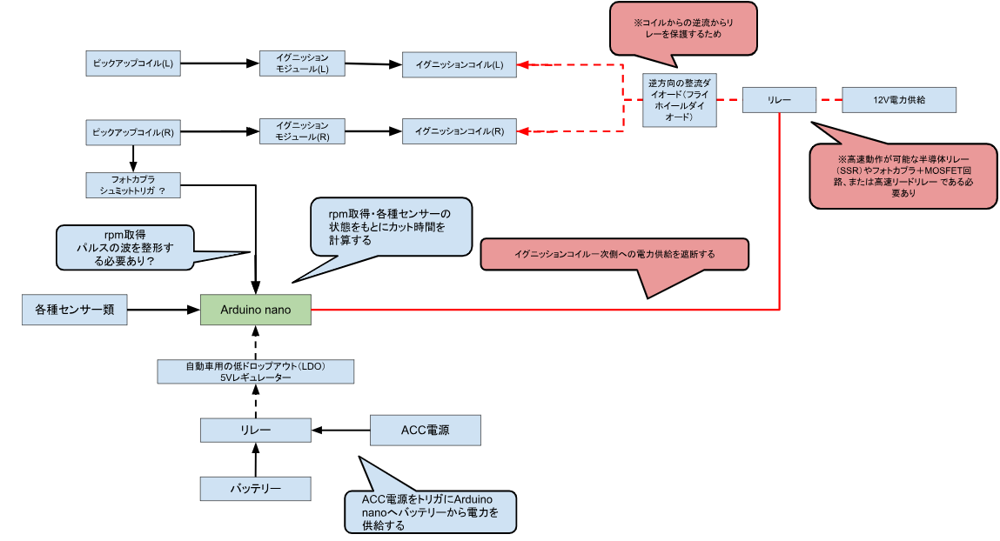

# 実装方針検討

## クイックシフター回路図

### 回路設計の仕様
1. システムの目的: Arduino nanoが各種センサーとエンジン回転数（rpm）を基にカット時間を計算し、点火コイルへの電力供給を遮断する。

2. 電源供給: ACC電源をトリガにしてリレーを作動させ、バッテリーからの電力を「自動車用低ドロップアウト（LDO）5Vレギュレーター」経由でArduinoへ安定供給する。

3. 信号入力（rpm取得）: ピックアップコイル（R）の信号をフォトカプラおよびシュミットトリガ回路に通し、パルス波形を整形してArduinoへ入力する。

4. 点火カット制御: Arduinoからの制御信号によって12V電力供給ラインのリレーを操作し、左右のイグニッションコイル（L/R）への供給を遮断する。

5. 高速リレーの必要性: 点火カットには瞬時の反応が求められるため、高速動作が可能な半導体リレー（SSR）、フォトカプラ＋MOSFET回路、または高速リードリレーの使用が必要である。

6. 逆起電力対策: コイルからの逆電流（サージ）からリレーを保護するため、12V供給ラインと各コイルの間に「逆方向の整流ダイオード（フライホイールダイオード）」を配置する。

### 注意点
- C++実装への要求： delay() 関数は絶対に使用せず、micros() または millis() を用いたステートマシン（状態遷移）で記述すること
- シフトスイッチのチャタリング対策（Debounce）を厳密に行わないと、1回のシフトで2回カットが入り、エンジンが失速する。
