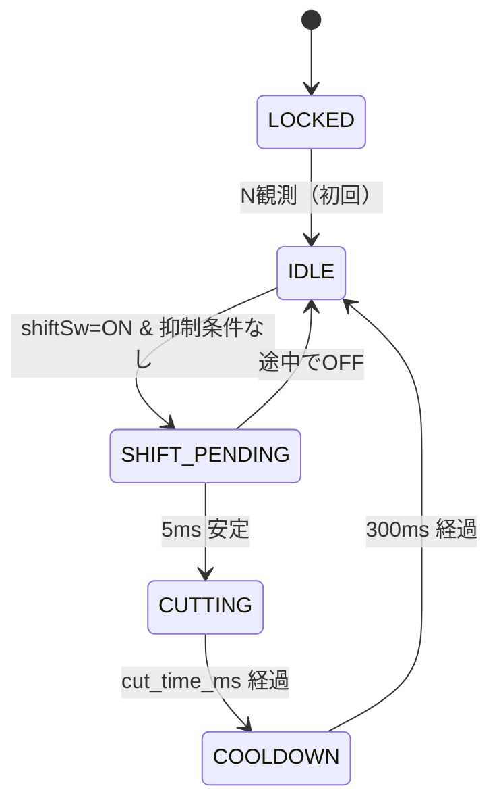

# 実装方針検討 — Ducati 900SS クイックシフター（Arduino Nano）

本ドキュメントは `docs/domain/` のドメイン情報および `docs/回路設計.md` のハードウェア方針を踏まえ、**プログラム実装（C++）の方針** を定める。実装着手前に本書の各決定を `config.h` に反映する。

対象車両の詳細は `CLAUDE.md` および `docs/domain/*.md` を参照。

---

## 0. エグゼクティブサマリ

| # | 領域 | 決定内容 |
|---|---|---|
| 1 | カット時間戦略 | rpm × ギア比の動的計算（整数演算） |
| 2 | ギア推定 | Nスイッチ基点 + シフトカウント（N離脱エッジで gear=1） |
| 3 | 計算モデル | `REVS_REQUIRED_X10[gear-1] × 6000 / rpm` |
| 4 | クラッチ役割 | 操作中はQS抑制（インヒビット） |
| 5 | 作動rpmレンジ | 3000 – 8500 rpm |
| 6 | クールダウン | 300 ms |
| 7 | 起動時フォールバック | N観測までロックアウト |
| 8 | ステートマシン | 5状態（ERROR は表示派生） |
| 9 | ファイル構成 | 4層（config / sensors / gear_logic / shifter）+ debug.h |
| 10 | rpm計測 | 直近4パルス周期の移動平均、片側ピックアップ単独タップ |
| 11 | 状態表示 | 単色LED 1個 × 点滅パターン |
| 12 | カット上下限 | 40 – 120 ms（チューニング初期は 80 まで絞る） |
| 13 | デバッグ | DEBUG_MODE + `snprintf` ベースイベント駆動ログ |
| 14 | 出力極性 | アクティブHIGH + WDT 1秒 |
| 15 | `REVS_REQUIRED_X10` 初期値 | `{ 80, 70, 60, 50, 45 }` |

---

## 1. 目的・スコープ

### 1.1 目的
- ライダーがクラッチ操作なしでシフトアップできる電子制御を実装する
- Arduino Nano 単体で、エンジンrpmと現在ギアに応じて**動的にカット時間を計算**する
- 安全性（誤作動防止・フェイルセーフ）と保守性（チューニング容易性）を両立する

### 1.2 スコープ
| 含む | 含まない |
|---|---|
| シフトアップ時の点火カット制御 | シフトダウン補助（オートブリッパー） |
| rpm計測・ギア状態管理 | 自動ギア学習・rpm低下率からの逆推定 |
| クラッチ抑制・ロックアウト等の安全機構 | 車速連動カット時間補正（センサーなし） |
| 状態表示LED | OLEDダッシュ表示・SDロガー |

---

## 2. 制御方針

### 2.1 カット時間の決定式

カット時間は **rpm とギアの両方から動的に算出** する。AVR の浮動小数演算を避けるため**整数演算で完結**させる（係数を10倍に整数化）。

```cpp
// REVS_REQUIRED_X10[idx] : revs_required を ×10 した整数値
// インデックスは gear - 1（gear ∈ [1,5] のみ計算経路に到達する）
uint32_t cut_time_ms = (uint32_t)REVS_REQUIRED_X10[gear - 1] * 6000UL / current_rpm;
cut_time_ms = constrain(cut_time_ms, MIN_CUT_MS, MAX_CUT_MS);
```

物理的根拠：ドッグが抜けるのに必要なのは「時間」ではなく**駆動軸の空転量**。クランク回転数で抽象化することで、高rpmでは自動的に短く、低rpmでは長く、各ギアの噛み合い特性に応じた値が得られる。

`gear` 範囲外（N および 6速）の阻止は §3.2 抑制条件に一元化されている。本式に到達した時点で `gear ∈ [1,5]` が保証される。

### 2.2 `REVS_REQUIRED_X10` 初期値

`docs/domain/gear.md` のギア比ステップに比例配分。

| インデックス | シフト遷移 | ギア比ステップ | `REVS_REQUIRED_X10` | rpm=5000 検算 | rpm=7000 検算 |
|---|---|---|---|---|---|
| `[0]` | 1→2 | 71.5% (-28.5%) | **80** | 96 ms | 69 ms |
| `[1]` | 2→3 | 76.5% (-23.5%) | **70** | 84 ms | 60 ms |
| `[2]` | 3→4 | 80.8% (-19.2%) | **60** | 72 ms | 51 ms |
| `[3]` | 4→5 | 87.8% (-12.2%) | **50** | 60 ms | 43 ms |
| `[4]` | 5→6 | 89.4% (-10.6%) | **45** | 54 ms | 40 ms（下限クランプ） |

これらは机上計算による初期値。実走チューニングで補正する前提。

### 2.3 絶対クランプ

| 定数 | 値 | 根拠 |
|---|---|---|
| `MIN_CUT_MS` | **40 ms** | `ignition.md` 推奨範囲下端。ドッグ移動に必要な機械的最小時間 |
| `MAX_CUT_MS` | **120 ms** | `ignition.md` 推奨上限。キャブ車のアフターファイア・エンスト回避 |

異常入力（rpm極小、配列インデックス異常）で計算が破綻しても本クランプで安全側に倒れる。**初期セットアップ時は `MAX_CUT_MS = 80` まで絞り段階拡張する**（アフターファイア抑制のため）。

### 2.4 作動許可rpmレンジ

```cpp
if (rpm < QS_RPM_MIN || rpm > QS_RPM_MAX) { /* QS抑制 */ }
```

| 定数 | 値 | 根拠 |
|---|---|---|
| `QS_RPM_MIN` | **3000 rpm** | `common.md` §4 推奨。キャブ車失火・エンスト防止 |
| `QS_RPM_MAX` | **8500 rpm** | `ignition.md` 最大出力発生回転数。レブリミット(9000)直前のオーバーシュート対策 |

### 2.5 ギア状態管理

#### 2.5.1 ギアカウンタの更新ルール

ギアポジションセンサーがないため、ニュートラルスイッチと QS シフトイベントを組み合わせて推定する。**Nの押下/離脱エッジを明示的に扱う**ことが重要（カウンタが進む契機を確保するため）。

```cpp
// 毎ループ実行（neutralIsPressed はデバウンス済み）
bool nNow = neutralIsPressed();
if (nNow && !nPrev) {
  currentGear = 0;            // Nに入ったエッジ
} else if (!nNow && nPrev) {
  currentGear = 1;            // Nから抜けたエッジ = 手動で1速にシフトダウンした
}
nPrev = nNow;

// QS シフトイベント完了時（§3.2 CUTTING → COOLDOWN 遷移時）
if (currentGear >= 1 && currentGear < 6) {
  currentGear++;              // 1→2, 2→3, ..., 5→6
}
```

この方式の前提と限界：
- **前提**：N→1 はクラッチ操作による手動シフト（シフトセンサーは上方向のみ反応のため、ペダルを踏み下げるN→1動作では発火しない）。N離脱エッジで「1速に入った」と推定する
- **限界**：1→N→2 のような飛びシフトでは、N離脱エッジで `currentGear=1` に固定セットされるため、**実ギアより1段少ない値で認識される**。これは次に N を経由するまで継続する（実走チューニング時にログで観測）
- **回復**：N を一度経由すれば再同期する

`currentGear` の宣言：`uint8_t currentGear`（取り得る値 `0..6`、0=N、1..6=各ギア）。`gear - 1` を引く前に `currentGear >= 1` であることは §3.2 抑制条件で保証される（`uint8_t(0) - 1 = 0xFF` の罠を回避）。

#### 2.5.2 起動時のロックアウト

Arduino起動時、N未観測の状態では現在ギアが不明。誤推定によるアフターファイア・失火を避けるため、**N を一度観測するまで QS を完全にロックアウト** する（§3.2 LOCKED 状態）。

| 起動シナリオ | 振る舞い |
|---|---|
| N で起動（通常起動） | LOCKED→IDLE に即遷移、通常動作 |
| 走行中Arduinoのみ再起動（停車で1速＋クラッチ等） | LOCKED 継続、ライダーが N に戻すと解除 |

ロックアウト中は状態LEDがゆっくり点滅（§4.1 参照）。

#### 2.5.3 ギア推定ずれの観測（自動補正はスコープ外）

自動補正は本実装スコープ外。チューニングと事後解析のため、**シフト前後の rpm を DEBUG ログに必ず残す**（§3.5）。`ratio = rpm_post / rpm_pre` を `gear.md` のギア比ステップと照合して、ずれを目視で検出する。

### 2.6 クラッチセンサーの役割

クラッチセンサー（DRC F5945 油圧スイッチ、§3.4.1 表）の役割は **QSの抑制（インヒビット）** に限定する。ライダーがクラッチを握っている＝意図的な手動シフト中、と解釈する。

```cpp
if (clutchPressed) { /* QS抑制：state は IDLE 維持 */ }
```

### 2.7 クールダウン

カット完了後、次のシフト検知を受け付けるまで **300 ms** 待つ。連続誤発動・カット直後のrpm揺り戻し誤検知の防止。人間の物理的な連続シフト最短間隔（脚の戻し時間）と整合する。

---

## 3. ソフトウェアアーキテクチャ

### 3.1 ファイル構成（4層）

姉妹プロジェクト `quick-shifter-with-arduino` の構成を踏襲。`.ino` は orchestrator のみ。

```
quick-shifter-with-claude-code.ino   ← setup() / loop() のみ
src/
  config.h          ← 全定数（ピン参照/閾値/タイミング/DEBUG）
  sensors.h/.cpp    ← 入力層: rpm測定(割込)、各SWのデバウンス
  gear_logic.h/.cpp ← 計算層: 現在ギア管理、cut_time_ms 算出、許可rpmレンジ判定
  shifter.h/.cpp    ← 出力層: ステートマシン、点火カット出力、状態LED制御
  debug.h           ← DEBUG_MODE 切替ロギングマクロ（§3.5）
```

#### 層間の依存規則
- `sensors` → ハードウェア（ピン・割込）のみに依存
- `gear_logic` → `sensors` と `config.h`
- `shifter` → `sensors`・`gear_logic`・`config.h`
- `.ino` → 上記の `init()` / `update()` を呼ぶのみ

#### ピン定義の単一の真実源

ピン番号・極性・入出力方向の正本は `docs/arduino/pin_assign.md`。`config.h` はその値を写すのみ。実装方針 §5 は pin_assign.md への差分のみ記述する。

#### `config.h` の全体像

```cpp
// ───── ピン定義（正本: docs/arduino/pin_assign.md） ─────
// 入力スイッチはすべてアクティブLOW（INPUT_PULLUP）
//   D5 シフトロッドSW   : 踏み込み = LOW（上方向プッシュ時のみ ON、§5.3 要確認）
//   D6 クラッチSW       : 油圧上昇 = LOW (DRC F5945)
//   D4 ニュートラルSW   : N位置   = LOW
// 出力はアクティブHIGH（§4.2）
//   D8 点火カット出力   : HIGH = カット
//   D7 状態LED          : HIGH = 点灯
#define PIN_RPM_PULSE     3   // INT1 (Nano)
#define PIN_SHIFT_SW      5
#define PIN_CLUTCH_SW     6
#define PIN_NEUTRAL_SW    4
#define PIN_CUT_OUTPUT    8
#define PIN_STATUS_LED    7

// rpm
#define QS_RPM_MIN        3000
#define QS_RPM_MAX        8500
#define RPM_AVG_SAMPLES   4    // 2のべき乗
#define RPM_TIMEOUT_MS    100

// カット時間
#define MIN_CUT_MS        40
#define MAX_CUT_MS        120
// 1→2, 2→3, 3→4, 4→5, 5→6 の遷移に対応。gear (1..5) から REVS_REQUIRED_X10[gear-1]。
// revs_required を ×10 して整数化（AVR の浮動小数を回避）。
const uint16_t REVS_REQUIRED_X10[5] = { 80, 70, 60, 50, 45 };

// タイミング
#define SHIFT_DEBOUNCE_MS    5
#define SWITCH_DEBOUNCE_MS   20    // クラッチ・N用
#define COOLDOWN_MS          300

// デバッグ
#define DEBUG_MODE             // 本番ビルドではコメントアウト
```

### 3.2 ステートマシン

`shifter` モジュール内の **5状態の有限状態機械**。`回路設計.md` の要請（`delay()` 禁止・`millis()`/`micros()` ベース）に従い、全遷移は時刻比較で行う。

ERROR は **状態として持たない**。表示（LED）レベルでのみ表現する派生情報とする（§4.1）。



**抑制条件（IDLE→SHIFT_PENDING を阻止）**：
- クラッチ ON
- rpm < `QS_RPM_MIN` または rpm > `QS_RPM_MAX`
- rpm 信号タイムアウト（直近 `RPM_TIMEOUT_MS` にパルスなし）
- `currentGear == 0`（N。シフトSWは上方向専用のためN中の押下は想定外）
- `currentGear == 6`（6速で頭打ち）

**LOCKED への復帰経路**：本実装では LOCKED への復帰は行わない。一度 N を観測したら、以降は走行中の異常は IDLE 側で表示・抑制で処理する。Arduino リセット時のみ再 LOCKED となる。

**遷移中のセンサー処理**：SHIFT_PENDING / CUTTING / COOLDOWN 状態でも N・クラッチ状態は読み続け、ギアカウンタは §2.5.1 のルールで更新する。新規シフトイベントは COOLDOWN 完了まで受け付けない。

### 3.3 RPM計測

#### 3.3.1 信号源

**タップ箇所は片側ピックアップ（22a または 22b）の1本のみ**（`docs/回路設計.md` 方針）。両ピックアップを併用しない理由：
- 90° V型2気筒のため両ピックアップ合成では**不等間隔パルス列**になり瞬時周期からの rpm 算出が不正確（`ignition.md` §2）
- 片側のみなら **クランク1回転 = 1パルス・等間隔**

| 項目 | 値 |
|---|---|
| 信号形態 | シュミットトリガ整形後のデジタルパルス（フォトカプラで絶縁） |
| パルスレート | 1パルス／クランク1回転 |
| rpm 想定範囲 | 1200（アイドル）〜 9000（レブ） |
| パルス周期 | 50 ms（1200 rpm）〜 6.67 ms（9000 rpm） |
| 結線方式 | ピックアップ → IDS 間から**並列分岐**して読み取り。元の点火経路は無改造で維持 |

#### 3.3.2 計測アルゴリズム

直近4パルス周期の移動平均。

```cpp
// sensors.cpp
volatile uint32_t lastPulseMicros;
volatile uint32_t periodSamples[RPM_AVG_SAMPLES];
volatile uint8_t  sampleIdx;
volatile bool     firstPulseSeen;   // 初回判定。lastPulseMicros=0 は使わない
                                    // (micros() ラップで0に当たると取りこぼすため)
volatile bool     periodsValid;

void onRpmPulseISR() {
  uint32_t now = micros();
  if (firstPulseSeen) {
    periodSamples[sampleIdx] = now - lastPulseMicros;
    sampleIdx = (sampleIdx + 1) & (RPM_AVG_SAMPLES - 1);
    if (sampleIdx == 0) periodsValid = true;
  }
  firstPulseSeen = true;
  lastPulseMicros = now;
}

uint16_t getRPM() {
  uint32_t copy[RPM_AVG_SAMPLES];
  uint32_t last;
  bool valid;
  // volatile 配列を memcpy で読むのは規格上 UB。noInterrupts 下で要素ごと代入する
  noInterrupts();
  for (uint8_t i = 0; i < RPM_AVG_SAMPLES; i++) copy[i] = periodSamples[i];
  last  = lastPulseMicros;
  valid = periodsValid;
  interrupts();

  if (!valid) return 0;
  if ((micros() - last) > (RPM_TIMEOUT_MS * 1000UL)) return 0;  // 信号断

  uint32_t sum = 0;
  for (uint8_t i = 0; i < RPM_AVG_SAMPLES; i++) sum += copy[i];
  return (uint16_t)(60000000UL / (sum / RPM_AVG_SAMPLES));
}

// 信号断のみを判定（低rpm抑制との区別に使う）。§4.5 ERROR フラグ・§4.1 LED 制御がこちらを参照
bool isRpmSignalAlive() {
  noInterrupts();
  bool seen = firstPulseSeen;
  uint32_t last = lastPulseMicros;
  interrupts();
  if (!seen) return false;
  return (micros() - last) <= (RPM_TIMEOUT_MS * 1000UL);
}
```

API の役割分担：`getRPM()` は信号断時もアイドル割れ時も `0` を返すため、両者を区別したい場合は `isRpmSignalAlive()` を併用する。

### 3.4 シフト・補助スイッチ

#### 3.4.1 物理層と極性

全入力スイッチは **アクティブLOW**（`INPUT_PULLUP` 受け、スイッチの他端を GND へ）。配線本数最小、断線時 HIGH＝リリース相当に倒れる。

| ピン | センサー | 押下時 | リリース時 | デバウンス | 備考 |
|---|---|---|---|---|---|
| D5 | シフトロッドSW (Yamaha 13S-82470-00 等) | LOW | HIGH | 5ms | 上方向プッシュ時のみ ON（§5.3 要確認） |
| D6 | クラッチSW (DRC F5945) | LOW | HIGH | 20ms | 油圧上昇＝握り |
| D4 | ニュートラルSW (純正) | LOW | HIGH | 20ms | 既存ハーネスから並列分岐。状態変化エッジで `currentGear` を §2.5.1 ルールで更新 |

#### 3.4.2 シフト検知ロジック

- **エッジトリガ**：LOW を 5ms 連続観測で「押下確定」
- 確定後 SHIFT_PENDING → CUTTING へ遷移
- カット完了＆クールダウン後、スイッチが一度 HIGH に戻ってから再受付（**リリース要件**）

リリース要件により以下も自動的に成立する：
- 押しっぱなしでの連続再発火を防止
- シフトSW固着（ONのまま）時は最初の1発で発火した後、自動的に無発火状態が続く（追加のタイムアウトガード不要）

### 3.5 デバッグ・ロギング

`DEBUG_MODE` マクロでコンパイル時切替。本番ビルドではシリアル出力コードが完全に消える。

`Serial.printf` は **AVR Arduino コアでは未サポート**（`HardwareSerial` に `printf` メンバなし）。`snprintf` で一時バッファに整形し `Serial.println` に渡す。

```cpp
// src/debug.h
#ifdef DEBUG_MODE
  #define DBG_INIT()  do { Serial.begin(115200); } while(0)
  #define DBG_EVENT(fmt, ...) do {                                \
    char _dbgbuf[64];                                             \
    snprintf(_dbgbuf, sizeof(_dbgbuf), fmt, ##__VA_ARGS__);       \
    Serial.print(millis()); Serial.print(F(": "));                \
    Serial.println(_dbgbuf);                                      \
  } while(0)
#else
  #define DBG_INIT()
  #define DBG_EVENT(fmt, ...)
#endif
```

- `snprintf` でバッファオーバーラン防止
- 文字列リテラルは `F()` で PROGMEM 配置し SRAM を節約
- **AVR-libc の `snprintf` はデフォルトで `%f` 非対応**（float サポートはリンカオプション `-Wl,-u,vfprintf -lprintf_flt` 等が別途必要）。本実装は整数のみで完結させること
- ログはイベント発生時のみ。連続ストリーム（rpm 毎パルスなど）は出さない

#### ログ出力項目

ギア推定ずれ解析（§2.5.4）のため、シフトイベント時は **シフト前/後の rpm と比率** を残す：

```
0:        SYSTEM_BOOT
1284:     LOCK_RELEASE gear=0
12340:    SHIFT_BEGIN  gear=2  rpm_pre=6800  cut=70ms
12410:    SHIFT_END    gear=3  rpm_post=5210  ratio_x1000=766
12710:    COOLDOWN_END
15022:    INHIBIT      reason=clutch
20011:    ERROR        rpm_signal_timeout
```

`ratio_x1000` は `(rpm_post * 1000) / rpm_pre`（整数）。`gear.md` のギア比ステップ（1→2: 715, ..., 5→6: 894）から大きく乖離していればギア推定ずれを疑う。

---

## 4. 安全設計

### 4.1 状態表示インジケータ（単色LED 1個）

LED の表示は **状態機械の状態（§3.2）＋異常フラグ** から派生算出する。「ERROR 表示状態」は状態機械上に存在せず、IDLE / LOCKED に滞在しながら表示だけ ERROR となる。

| LED表示 | 表示条件 |
|---|---|
| 常時消灯 | 電源断（Arduino電源喪失） |
| 常時点灯 | state == IDLE & 異常フラグなし |
| ゆっくり点滅（1Hz） | state == LOCKED |
| 速い点滅（5Hz） | 異常フラグあり（rpm信号断） |
| 短時間点灯 | state == CUTTING（視覚的フィードバック） |

#### 異常フラグ

| フラグ | セット | クリア |
|---|---|---|
| rpm信号断 | 直近 `RPM_TIMEOUT_MS` 以上パルスなし | パルス再開（getRPM が非ゼロ） |

#### 優先順位

CUTTING（短時間） > LOCKED > ERROR > IDLE。例：起動直後にライダーが N を踏まずクラッチを握ったまま放置するとエンジン未始動で rpm信号断となるが、このときは LOCKED 表示を優先する（ライダーが先に N を踏むべきため）。LOCKED から ERROR への遷移ロジックは実装しない。

物理的LEDは外部に1個。`PIN_STATUS_LED`（D7）から駆動。Arduino Nano の内蔵LED（D13）にミラーすればベンチ確認も容易。

### 4.2 フェイルセーフ方向

**点火カット出力は アクティブHIGH**。

| Arduino 出力ピン | 動作 |
|---|---|
| LOW（電源断/リセット中/起動直後/IDLE） | 点火通常通電 |
| HIGH（CUTTING状態のみ） | 点火カット |

ハードウェア側のリレー/MOSFET駆動回路も「HIGH駆動でコイル一次断」となるよう設計する。これにより Arduino が死んでも点火系は通常動作に倒れる（走行中エンスト・転倒回避）。

起動時の不定状態対策：
- `pinMode(PIN_CUT_OUTPUT, OUTPUT)` の **前** に `digitalWrite(LOW)` を呼ぶ
- ハードウェア側に 10kΩ 外部プルダウンを設置

### 4.3 ウォッチドッグタイマー（WDT）

AVR内蔵WDTを **1秒** で有効化。`loop()` で `wdt_reset()` を呼び続け、ハングしたら Arduino が自動リセットされる。リセット後は §4.2 によりカット出力は LOW（= 通常点火）に戻るため、最悪ケースでもエンジンは止まらない。

#### DEBUG_MODE 時の注意

115200 bps で TXバッファ満杯 → `Serial.println` ブロッキング → 1秒以内に解消しなければ WDT リセット、という連鎖が起きうる。

対策：
- ログを1行・短く保つ（§3.5 方針に合致済）
- ベンチテストでランダムリセットが頻発する場合、`setup()` で `#ifdef DEBUG_MODE` 分岐し WDT を 2秒に延長
- 本番ビルド（DEBUG_MODE 無効）ではこの問題は発生しない

### 4.4 ハードウェア・ソフトウェア間の絶対クランプ（二重防御）

ソフト側で `MAX_CUT_MS = 120 ms` を超える出力時間を絶対に発生させない。さらに CUTTING 滞在時間にも独立した上限ガードを置く：

```cpp
if (state == CUTTING && (millis() - cutStartMs) > MAX_CUT_MS) {
  forceEndCut();
  DBG_EVENT("ERROR cut_overrun");
}
```

`forceEndCut()` の責務（`shifter` モジュールが提供）：
1. 点火カット出力ピンを `LOW` に戻す（`digitalWrite(PIN_CUT_OUTPUT, LOW)`）
2. state を `COOLDOWN` に強制遷移する
3. `cooldownStartMs = millis()` をセットして COOLDOWN 期間の起点を更新する

「計算結果ではなく経過時間そのもの」を見る独立ガード。`cut_time_ms` の計算ミスや変数破壊に対する二重防御。

### 4.5 入力異常への対処

| 異常 | 検知 | 対応 |
|---|---|---|
| rpm 信号断 | 直近 100ms にパルス無し | 抑制（QS不発動）、LED ERROR点滅、ログ出力 |
| シフトSW 固着 | §3.4.2 のリリース要件で自動的に1発限り発火 | 追加ガード不要 |
| クラッチSW 断線 | 検知困難（プルアップにより常時 HIGH = リリース相当） | クラッチ抑制が効かなくなる。3000rpm 以上で握り換え操作中に意図せず QS が発動する可能性あり。`MAX_CUT_MS=120` クランプと §4.2 フェイルセーフ方向が最終防衛線。断線検知は将来拡張（§6.2） |
| N SW 断線 | 検知困難（常時 HIGH = N以外） | LOCKED から脱出不能。LED 1Hz 点滅でライダーが気付ける |

---

## 5. ハードウェア要件（pin_assign.md への差分）

ピン正本は `docs/arduino/pin_assign.md`。本実装では**2ピン追加と1件の誤記訂正**を pin_assign.md 側で行う必要がある。

### 5.1 追加ピン

| ピン | 役割 | 入出力 | 接続先 | 備考 |
|---|---|---|---|---|
| **D4** | ニュートラルスイッチ | INPUT_PULLUP | 既存ニュートラルインジケータ配線（`wiring.md` (14)） | アクティブLOW、並列分岐 |
| **D7** | 状態LED | OUTPUT | 外部LED + 330Ω 抵抗 + GND | アクティブHIGH、D13 内蔵LEDにミラー可 |

### 5.2 誤記訂正
- `pin_assign.md` の D3 備考欄「外部割り込み(INT0)」→ 正しくは **INT1**（Nano の INT0 は D2、INT1 は D3）

### 5.3 シフトセンサーの単方向性確認

ヤマハ 13S-82470-00（および同等品）の前提として、**上方向（シフトアップ方向）プッシュ時のみ ON** となる単方向動作が必要。もし双方向（シフトアップ/ダウン両方で ON）であれば、シフトダウン時に QS が誤発動し、駆動系ドッグに過大荷重がかかる重大事故になる。

着手前に：
- メーカー仕様書または現物試験で単方向性を確認
- 結果を `docs/domain/sensors.md` §1 に明記
- 万一双方向品しか入手できない場合は **機構的に上方向のみ作動する取り付け** を別途検討

### 5.4 ニュートラルスイッチ配線

既存メインハーネスのニュートラルインジケータ信号線を分岐して D4 に接続。元のニュートラルランプ回路には干渉しない（並列読み取りのみ）。「Nのとき GND 接続 = LOW」、`INPUT_PULLUP` で読み取り。

### 5.5 本実装着手前のドキュメント追対応チェックリスト

| # | 対象ファイル | 内容 |
|---|---|---|
| 1 | `docs/arduino/pin_assign.md` | D4（N）と D7（LED）の追加、D3 の INT0→INT1 誤記訂正、全入力ピンの極性・`INPUT_PULLUP` 要否欄を追加 |
| 2 | `docs/domain/sensors.md` | シフトセンサーの単方向性（上方向プッシュ時のみ ON）を明記 |
| 3 | `docs/domain/ignition.md` | 本実装が片側ピックアップのみをタップする旨を補足 |

---

## 6. スコープ外・将来拡張

### 6.1 本実装スコープ外
- シフトダウン補助（オートブリッパー）：スロットル制御が必要、本車に機構なし
- 車速連動カット時間補正：車速センサーなし
- 自動ギア学習（rpm低下率からの逆推定）：本実装は N基点カウントで決定的に運用

### 6.2 将来拡張余地
- **ギア推定ずれの自動検知**：§2.5.4 のログを走行中に自動判定して ERROR 表示
- **クラッチセンサー断線検知**：常時微弱電流の電圧モニタ回路を追加
- **2チャンネル独立カット**：水平・垂直コイルを別ピン制御、段差カットでアフターファイア低減
- **キャリブレーションモード**：シフトSW長押し起動で `REVS_REQUIRED_X10[]` を EEPROM 書換
- **rpm 信号源の冗長化**：タコメーター信号線（IDS → REV COUNTER, `wiring.md` (5)、整形済みで安定）併用してフェイルオーバー
- **OLED表示**：rpm／現在ギア／直近カット時間のリアルタイム表示

---

## 7. チューニング手順（実装完了後）

実装完了後に実走で `REVS_REQUIRED_X10[]` を追い込む。手順詳細は実装完了時点で別途まとめる予定。要点のみ列挙：

1. **ベンチテスト**：エンジン停止、各SWを手動操作し DEBUG_MODE で状態遷移を確認。擬似rpmパルス入力でカット出力を実測
2. **停車エンジンON**：LED が LOCKED→IDLE、クラッチ抑制、rpm下限抑制を確認
3. **低速実走（1→2のみ）**：`MAX_CUT_MS` を一時的に 80 に絞る。突き上げ感／吹け上がり過剰／アフターファイア兆候（マフラー内パンッ音、白煙）を観察しつつ `REVS_REQUIRED_X10[0]` を調整
4. **全ギア追い込み**：4500rpm 帯と 7000rpm 帯で各シフト遷移を試し、ログの `ratio_x1000` を `gear.md` のギア比ステップと照合
5. **本番ビルド**：`MAX_CUT_MS` を 120 に戻し、`DEBUG_MODE` をコメントアウト
