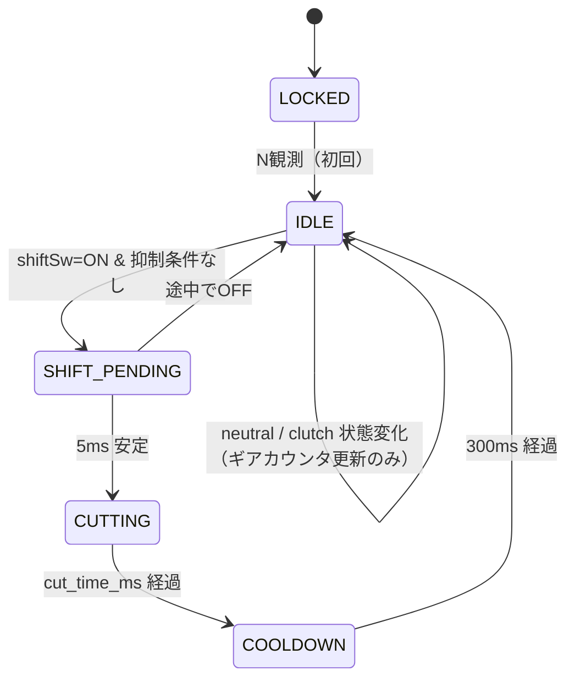

# 実装方針検討 — Ducati 900SS クイックシフター（Arduino Nano）

本ドキュメントは `docs/domain/` 配下のドメイン情報、および `docs/回路設計.md` のハードウェア方針を踏まえ、**プログラム実装（C++）の方針** を定めるものである。市販クイックシフター（Healtech iQSE、Translogic、HM 等）と遜色ない機能性と、姉妹プロジェクト `quick-shifter-with-arduino` と一貫したメンテナンス性の両立を目指す。

実装着手前に本ドキュメント記載の各決定を確定させ、`config.h` に反映する想定。

> **改訂履歴**：初版作成 → `docs/レビュー指摘.md` の R-1〜R-16 を反映した第2版。詳細は §9 参照。

---

## 1. 目的・スコープ

### 1.1 目的
- ライダーがクラッチ操作なしでシフトアップできる電子制御を実装する
- Arduino Nano 単体で、エンジンrpmと現在ギアに応じて**動的にカット時間を計算**する
- 安全性（誤作動防止・フェイルセーフ）と保守性（チューニング容易性）を両立する

### 1.2 スコープ
| 含む | 含まない |
|---|---|
| シフトアップ時の点火カット制御 | シフトダウン補助（オートブリッパー） |
| rpm計測・ギア状態管理 | ABS/トラコン等の高度な車両制御 |
| クラッチ抑制・ロックアウト等の安全機構 | スマートフォン連携・遠隔チューニング |
| 状態表示LED | OLEDダッシュ表示・SDロガー（将来検討） |

### 1.3 対象車両前提（再掲）
- Ducati 900SS（1995年式キャブレター車）
- KOKUSAN製誘導放電点火、9000 rpm レブリミット、アイドル 1200-1300 rpm
- 車速センサーなし、ギアポジションセンサーなし、TPSなし、ニュートラルスイッチのみ
- 詳細は `docs/domain/` 各ファイル参照

---

## 2. 制御方針

### 2.1 カット時間の決定式（コア・アルゴリズム）

カット時間は**rpmとギアの両方から動的に算出**する。固定値テーブルではなくクランク回転数ベースの物理モデルを採用する。AVR の浮動小数演算を避けるため**整数演算で完結**させる（係数を10倍に整数化、後段で割り戻す）。

```cpp
// 概念式（整数演算）
//   revs_required[gear] を ×10 して整数化した配列を REVS_REQUIRED_X10 とする
//   cut_ms = revs_required × (60000 / rpm)
//          = (REVS_REQUIRED_X10[idx] × 6000) / rpm   ※ /10 を 60000→6000 で吸収
uint32_t cut_time_ms = (uint32_t)REVS_REQUIRED_X10[gear - 1] * 6000UL / current_rpm;
cut_time_ms = constrain(cut_time_ms, MIN_CUT_MS, MAX_CUT_MS);
```

| パラメータ | 意味 |
|---|---|
| `REVS_REQUIRED_X10[idx]` | 「ドッグが次段に噛み合うまでにエンジンが空転すべきクランク回転数」を10倍した整数 |
| `6000 / rpm` | 「rpm→1回転に要する時間 [ms]」を10倍係数を吸収しつつ換算 |
| `MIN_CUT_MS` / `MAX_CUT_MS` | 計算式が暴走しても出力が暴れないための絶対クランプ |

配列の長さは **5要素**（1→2, 2→3, 3→4, 4→5, 5→6 の遷移ぶん）に限定する。`gear - 1` でインデックス変換すると同時に、`gear ∈ [1,5]` の範囲外を呼び出し側で必ず弾く（§2.5.3 と §3.2 で担保）。N（gear=0）や 6速（gear=6）でこの計算が走る経路は存在しない。

物理的根拠：シフト機構が荷重を抜いてドッグから抜けるのに必要なのは「時間」ではなく**駆動軸の空転量**である。クランク回転数で抽象化することで、高rpmでは自動的に短く、低rpmでは長く、各ギアの噛み合い特性に応じた値が得られる。

### 2.2 `REVS_REQUIRED_X10` 初期値

`docs/domain/gear.md` のギア比ステップ（シフトアップ時の回転数変化率）に比例配分する。

| インデックス | シフト遷移 | ギア比ステップ | `REVS_REQUIRED_X10` | 元の回転数 | rpm=5000 | rpm=7000 |
|---|---|---|---|---|---|---|
| `[0]` | 1速→2速 | 71.5% (-28.5%) | **80** | 8.0 回転 | 96 ms | 69 ms |
| `[1]` | 2速→3速 | 76.5% (-23.5%) | **70** | 7.0 回転 | 84 ms | 60 ms |
| `[2]` | 3速→4速 | 80.8% (-19.2%) | **60** | 6.0 回転 | 72 ms | 51 ms |
| `[3]` | 4速→5速 | 87.8% (-12.2%) | **50** | 5.0 回転 | 60 ms | 43 ms |
| `[4]` | 5速→6速 | 89.4% (-10.6%) | **45** | 4.5 回転 | 54 ms | 40 ms (下限クランプ) |

これらは**机上計算による初期値**であり、実走チューニングで補正する前提。`config.h` 冒頭にコメント付きで配置する。

### 2.3 絶対クランプ

| 定数 | 値 | 根拠 |
|---|---|---|
| `MIN_CUT_MS` | **40 ms** | `ignition.md` 推奨範囲（30〜150ms）の下端付近、ドッグ移動に必要な機械的最小時間 |
| `MAX_CUT_MS` | **120 ms** | `ignition.md` 推奨上限。キャブ車のアフターファイア・エンスト回避 |

異常入力（rpm極小、配列インデックス異常等）で計算が破綻しても、本クランプによりエンジン側の安全が担保される。

> **アフターファイア対策のチューニング上の運用**：
> 初期セットアップ時は `MAX_CUT_MS = 80` まで切り下げて段階的に開始することを推奨。突き上げ感（シフト不成立感）が出るまで `MAX_CUT_MS` を段階的に拡げ、その上で `REVS_REQUIRED_X10` を微調整する。アフターファイア発生兆候（マフラー内パンッ音、排気の白煙、不安定なパワーバンド遷移）は §6 を参照。

### 2.4 作動許可rpmレンジ

```cpp
if (rpm < QS_RPM_MIN || rpm > QS_RPM_MAX) {
  // QS抑制：通常シフト操作を要求
}
```

| 定数 | 値 | 根拠 |
|---|---|---|
| `QS_RPM_MIN` | **3000 rpm** | `docs/domain/common.md` セクション4 推奨。キャブ車失火・エンスト防止 |
| `QS_RPM_MAX` | **8500 rpm** | `docs/domain/ignition.md` 最大出力発生回転数。レブリミット(9000)直前のオーバーシュート対策 |

### 2.5 ギア状態管理

#### 2.5.1 ギア推定方式
本車にはギアポジションセンサーがない。車速センサーもないため逆算もできない。よって**ニュートラルスイッチを基点にシフト操作回数をカウントする**方式を採用する。

```cpp
// 概念
if (neutralSwitchPressed) currentGear = 0;        // N
else if (shiftEventCompleted) currentGear++;       // N→1, 1→2, ...
if (currentGear > 6) currentGear = 6;              // 6速で頭打ち
```

#### 2.5.2 初期状態とロックアウト

Arduino起動時、ニュートラル未観測の状態では現在ギアが不明である。誤推定によるアフターファイア・失火を避けるため、**N を一度観測するまで QS を完全にロックアウトする**。

| 起動シナリオ | 振る舞い |
|---|---|
| N で起動（通常起動） | LOCKED→IDLE に即遷移、通常動作 |
| 走行中Arduinoのみ再起動（停車で1速＋クラッチ） | LOCKED 継続、ライダーが N に戻すと解除 |

ロックアウト中は状態LEDが**ゆっくり点滅（1Hz）** してライダーに知らせる（§4.1 参照）。

#### 2.5.3 6速での操作
`currentGear == 6` のときシフトスイッチが押されても、シフトイベントとして処理しない（カウントも増やさない、カットも出さない）。レブリミット手前で誤って操作した場合の安全策。

#### 2.5.4 ギア推定ずれの観測（自動検知はスコープ外、ログには残す）

カウンタが実ギアと乖離した場合、過小カット（突き上げ）または過大カット（アフターファイア）として走行中に顕在化する。自動補正（rpm低下率からのギア逆推定）は本実装では行わない（§7.1 スコープ外）が、**チューニングと事後解析を可能にするため、シフト前後の rpm を DEBUG ログに必ず残す**（§3.5 参照）。
- 1→2 で実測の rpm 比率（cut完了直後 / cut開始直前）が 0.60 を下回る、または 0.80 を上回る場合はギア推定ずれを疑う
- 異常を自動検出して ERROR 表示するロジックは将来拡張候補（§7.2）

### 2.6 クラッチセンサーの役割

クラッチセンサー（`sensors.md` の DRC F5945 油圧スイッチ）の役割は **QSの抑制（インヒビット）** に限定する。ライダーがクラッチを握っている＝意図的な手動シフト中、と解釈する。

```cpp
if (clutchPressed) {
  // QS抑制：state は IDLE 維持、シフト検知しても無視
}
```

これにより市販QSの標準動作と一致し、カット時間設計もノークラッチ前提に統一できる。

### 2.7 クールダウン

カット完了後、次のシフト検知を受け付けるまでに **300 ms のクールダウン** を挟む。

| 期間 | 目的 |
|---|---|
| シフト検知デバウンス前 | チャタリング除去（5ms 安定確認） |
| カット出力中 | 計算された cut_time_ms |
| **クールダウン（300ms）** | **連続誤発動・カット直後のrpm揺り戻し誤検知の防止** |

人間の物理的な連続シフト最短間隔（脚の戻し時間 ~200-300ms）と整合する。

---

## 3. ソフトウェアアーキテクチャ

### 3.1 ファイル構成（4層）

姉妹プロジェクト `quick-shifter-with-arduino` の構成を踏襲する。`.ino` は orchestrator のみとし、責務を `src/` 配下に分離する。

```
quick-shifter-with-claude-code.ino   ← setup() / loop() のみ
src/
  config.h          ← 全定数（ピン参照/ギア比/REVS_REQUIRED_X10/閾値/タイミング/DEBUG）
  sensors.h/.cpp    ← 入力層: rpm測定(割込)、シフト/クラッチ/Nスイッチのデバウンス
  gear_logic.h/.cpp ← 計算層: 現在ギア管理、cut_time_ms 算出、許可rpmレンジ判定
  shifter.h/.cpp    ← 出力層: ステートマシン本体、点火カット出力、状態LED制御
  debug.h           ← DEBUG_MODE 切替ロギングマクロ（§3.5）
```

#### 層間の依存規則
- `sensors` → ハードウェア（ピン入力・割込）のみに依存
- `gear_logic` → `sensors` の読取API、および `config.h` の係数に依存
- `shifter` → `sensors`・`gear_logic` を呼び、`config.h` のタイミング定数を使用
- `.ino` → 上記モジュールの `init()` と `update()` を呼ぶのみ

#### ピン定義の単一の真実源
**ピン番号・極性・入出力方向の正本は `docs/arduino/pin_assign.md`** とする。`config.h` 内のピン定数は pin_assign.md の値を写すのみ（コメントで参照を明示）。実装方針 §5 は pin_assign.md に対する**差分・補足**だけを記述する。

#### `config.h` の責務（全チューニング項目を集約）
```cpp
// ───────── ピン定義（正本: docs/arduino/pin_assign.md） ─────────
// すべての入力スイッチはアクティブLOW（INPUT_PULLUP 前提）
//   - D5  シフトロッドSW   : 踏み込み = LOW
//   - D6  クラッチSW       : 油圧上昇 = LOW (DRC F5945)
//   - D4  ニュートラルSW   : N位置   = LOW
// 出力はアクティブHIGH（§4.2 参照）
//   - D8  点火カット出力   : HIGH = カット
//   - D7  状態LED          : HIGH = 点灯
#define PIN_RPM_PULSE     3   // INT1 (Nano)
#define PIN_SHIFT_SW      5
#define PIN_CLUTCH_SW     6
#define PIN_NEUTRAL_SW    4   // 追加 (pin_assign.md 第2版で正式採番)
#define PIN_CUT_OUTPUT    8
#define PIN_STATUS_LED    7   // 追加。D13 内蔵LEDにミラー可

// rpm 関連
#define QS_RPM_MIN        3000
#define QS_RPM_MAX        8500
#define RPM_AVG_SAMPLES   4    // 直近Nパルス平均（2のべき乗）
#define RPM_TIMEOUT_MS    100  // パルス断検出

// カット時間
#define MIN_CUT_MS        40
#define MAX_CUT_MS        120
// インデックス 0..4 が 1→2, 2→3, 3→4, 4→5, 5→6 の遷移に対応。
// gear（1..5）から引くときは REVS_REQUIRED_X10[gear - 1]。
// 値は revs_required を ×10 して整数化したもの（AVRの浮動小数を回避）。
const uint16_t REVS_REQUIRED_X10[5] = { 80, 70, 60, 50, 45 };

// タイミング
#define SHIFT_DEBOUNCE_MS    5
#define SWITCH_DEBOUNCE_MS   20    // クラッチ・N用
#define COOLDOWN_MS          300

// デバッグ
#define DEBUG_MODE             // 本番ビルドではコメントアウト
```

### 3.2 ステートマシン

実装の中核は `shifter` モジュール内の **5状態の有限状態機械** とする。`回路設計.md` の要請（`delay()` 禁止・`millis()`/`micros()` ベース）に従い、全遷移は時刻比較で行う。

> **ERROR の取り扱い**：rpm 信号断などの異常は**状態として持たない**。表示（LED）レベルでのみ表現する派生情報とし、状態機械の一意性を保つ。詳細は §4.1 参照。



| 状態 | 滞在条件 | 遷移先 |
|---|---|---|
| LOCKED | N 未観測 | → IDLE（N 初回観測時） |
| IDLE | QS発動待機 | → SHIFT_PENDING（シフトSW ON & 抑制条件なし） |
| SHIFT_PENDING | デバウンス中 | → CUTTING（5ms 安定）／ → IDLE（途中で OFF） |
| CUTTING | 点火カット出力中 | → COOLDOWN（cut_time_ms 経過） |
| COOLDOWN | 連続発動抑止 | → IDLE（300ms 経過） |

**LOCKED への復帰経路**：本実装では LOCKED への復帰は行わない（一度 N を観測したら、以降は走行中の異常が起きても IDLE 側で表示・抑制で処理する）。Arduino 自体がリセットされた場合のみ再 LOCKED となる。

#### 抑制条件（IDLE→SHIFT_PENDING を阻止する条件群）
- クラッチ ON
- rpm < QS_RPM_MIN または rpm > QS_RPM_MAX
- rpm 信号タイムアウト（直近 100ms にパルスなし）
- `currentGear == 6`（6速で頭打ち）
- `currentGear == 0`（N から直接の発火は想定しない）

#### 遷移中のセンサー処理
SHIFT_PENDING / CUTTING / COOLDOWN 状態でも `sensors` 層のN・クラッチ状態は読み続け、ギアカウンタは更新する（neutral 観測でカウンタを 0 に再同期）。ただし新規シフトイベントは COOLDOWN 完了まで受け付けない。

### 3.3 RPM計測

#### 3.3.1 物理層の前提（信号源と単位パルス数）

**タップ箇所は片側ピックアップ（22a または 22b）の1本のみ**とする（`docs/回路設計.md` の方針を踏襲）。両ピックアップを併用しない理由は次の通り：
- 90° V型2気筒のため、両ピックアップを合成すると**不等間隔パルス列**になり、瞬時周期からの rpm 算出が不正確になる（`docs/domain/ignition.md` §2 注記）
- 片側のみなら **クランク1回転 = 1パルス・等間隔** の規則的な信号として扱える

| 項目 | 値 |
|---|---|
| 信号形態 | シュミットトリガ整形後のデジタルパルス（フォトカプラでArduino側絶縁） |
| パルスレート | **1パルス／クランク1回転**（片側ピックアップ前提） |
| rpm 想定範囲 | 1200（アイドル）〜 9000（レブ） |
| パルス周期 | 50 ms（1200 rpm）〜 6.67 ms（9000 rpm） |
| 並列読み取り | ピックアップ → IDS（純正点火モジュール）間に**割り込まず**、信号線から並列分岐して読み取る。元の点火経路は無改造で維持する |

> **代替信号源（将来検討）**：純正タコメーター信号線（IDS → REV COUNTER, `wiring.md` (5)）は IDS によりパルス整形済みで安定しているため、ノイズ環境次第ではこちらをタップする選択肢もある（`wiring.md` 脚注の推奨）。本実装では片側ピックアップ直結で進めるが、ベンチテスト（§6.1）で信号品質を実測し、ノイズが多ければタコ信号への切替を検討する。

#### 3.3.2 計測アルゴリズム

**直近4パルス周期の移動平均** を採用する。

```cpp
// sensors.cpp（概念）
volatile uint32_t lastPulseMicros;
volatile uint32_t periodSamples[RPM_AVG_SAMPLES];
volatile uint8_t  sampleIdx;
volatile bool     firstPulseSeen;     // 初回パルス検出フラグ（lastPulseMicros=0 によらず）
volatile bool     periodsValid;       // RPM_AVG_SAMPLES 個揃ったか

void onRpmPulseISR() {
  uint32_t now = micros();
  if (firstPulseSeen) {
    periodSamples[sampleIdx] = now - lastPulseMicros;
    sampleIdx = (sampleIdx + 1) & (RPM_AVG_SAMPLES - 1);
    if (sampleIdx == 0) periodsValid = true;
  }
  firstPulseSeen = true;
  lastPulseMicros = now;
}

uint16_t getRPM() {
  uint32_t copy[RPM_AVG_SAMPLES];
  uint32_t last;
  bool valid;
  noInterrupts();
  for (uint8_t i = 0; i < RPM_AVG_SAMPLES; i++) copy[i] = periodSamples[i];
  last  = lastPulseMicros;
  valid = periodsValid;
  interrupts();

  if (!valid) return 0;
  if ((micros() - last) > (RPM_TIMEOUT_MS * 1000UL)) return 0;  // 信号断

  uint32_t sum = 0;
  for (uint8_t i = 0; i < RPM_AVG_SAMPLES; i++) sum += copy[i];
  uint32_t avgPeriod_us = sum / RPM_AVG_SAMPLES;
  return (uint16_t)(60000000UL / avgPeriod_us);
}
```

実装上の注意：
- **初回パルス判定に `lastPulseMicros != 0` を使わない**。`micros()` は約 71.6 分でラップアラウンドし、運悪く 0 に当たった瞬間に1パルス取りこぼす。`firstPulseSeen` フラグで明示判定する
- **`volatile` 配列を `memcpy` で読まない**。C++ 規格上は未定義動作。`noInterrupts()` ガード下で要素ごとに代入する（ループは 4 回なので性能影響なし）

#### 3.3.3 設計トレードオフ
| 項目 | 採用案（4パルス平均） | 単発周期 | 固定窓カウント |
|---|---|---|---|
| 応答性 | 最大 80ms（rpm=3000時） | 即時 | 100ms 固定 |
| ノイズ耐性 | 中（平均でジッタ低減） | 弱 | 強 |
| 低rpm分解能 | 高 | 高 | 低（rpm=600刻み等） |
| 実装複雑度 | 中 | 低 | 低 |

応答性・精度・実装容易性のバランスから 4パルス平均を選定。`RPM_AVG_SAMPLES` は 2 のべき乗にしておくとビット AND で剰余演算でき高速。

### 3.4 シフト・補助スイッチの検知

#### 3.4.1 物理層と極性

全入力スイッチは **アクティブLOW** で揃える（§3.1 `config.h` コメント参照）。Arduino側は `INPUT_PULLUP` で受け、スイッチの他端を GND に落とす。これにより：
- 配線本数が最小（信号線1本＋GND）
- 断線時は HIGH（= リリース相当）に倒れるため、シフト・クラッチ・N いずれも「押されていない側」に倒れる

| ピン | センサー | 押下時 | リリース時 | 備考 |
|---|---|---|---|---|
| D5 | シフトロッドSW (Yamaha 13S-82470-00 等) | LOW | HIGH | 上方向プッシュ時のみ ON（§5.2 要確認） |
| D6 | クラッチSW (DRC F5945) | LOW | HIGH | 油圧上昇＝クラッチ握り |
| D4 | ニュートラルSW (純正) | LOW | HIGH | 既存ハーネスから並列分岐 |

#### 3.4.2 シフト検知ロジック

- **エッジトリガ**：LOW を 5ms 連続観測で「押下確定」（チャタリング除去）
- 確定後は SHIFT_PENDING → CUTTING へ遷移
- カット完了＆クールダウン後、スイッチが一度 HIGH に戻ってから再受付する（**リリース要件**）

リリース要件により以下も自動的に成立する：
- 押しっぱなしでの連続再発火を防止
- シフトSW固着（ONのまま）時は最初の1発で発火した後、自動的に無発火状態が続く（追加のタイムアウトガードは不要）

#### 3.4.3 クラッチ・Nスイッチのデバウンス

シフトSWより遅い 20ms デバウンスで読み取り（高速応答が不要なため、ノイズ耐性を優先）。状態変化のエッジで `currentGear` を更新する。

### 3.5 デバッグ・ロギング

`DEBUG_MODE` マクロでコンパイル時に切替。本番ビルドではコンパイル後の機械語からシリアル出力コードが完全に消える。

`Serial.printf` は **AVR Arduino コアでは未サポート**（`HardwareSerial` に `printf` メンバなし）。`snprintf` で一時バッファに整形してから `Serial.println` に渡す方式とする。

```cpp
// src/debug.h
#ifdef DEBUG_MODE
  #define DBG_INIT()  do { Serial.begin(115200); } while(0)
  #define DBG_LINE(buf, fmt, ...) do {                          \
    char buf[64];                                               \
    snprintf(buf, sizeof(buf), fmt, ##__VA_ARGS__);             \
    Serial.print(millis()); Serial.print(F(": "));              \
    Serial.println(buf);                                        \
  } while(0)
  #define DBG_EVENT(fmt, ...) DBG_LINE(_dbgbuf, fmt, ##__VA_ARGS__)
#else
  #define DBG_INIT()
  #define DBG_EVENT(fmt, ...)
#endif
```

- `snprintf` ベースでバッファオーバーラン防止
- 文字列リテラルは `F()` で PROGMEM に置きSRAM 節約
- ログはイベント発生時のみ。連続ストリーム（rpm 毎パルスなど）は出さない

#### ログ出力項目

シフトイベント時は **シフト前/後のrpmと予測比率** を必ず残し、§2.5.4 のギア推定ずれ解析を可能にする：

```
0:        SYSTEM_BOOT
1284:     LOCK_RELEASE gear=0
12340:    SHIFT_BEGIN  gear=2  rpm_pre=6800  cut=70ms
12410:    SHIFT_END    gear=3  rpm_post=5210  ratio=0.766
12710:    COOLDOWN_END
15022:    INHIBIT      reason=clutch
20011:    ERROR        rpm_signal_timeout
```

1行1イベントの CSV ライクな形式とし、PC上でExcel/Pythonで時系列解析しやすくする。`ratio = rpm_post / rpm_pre` が `gear.md` のギア比ステップ（1→2 なら 0.715）から大きく乖離していればギア推定ずれを疑う指針となる。

#### DEBUG_MODE 時の WDT 注意点

§4.3 のウォッチドッグタイマーは 1秒。115200 bps でシリアル出力中、PC側の受信が遅れて TX バッファが満杯になると `Serial.println` がブロッキングし、最悪 1秒以内に解消しなければ WDT リセットが走る。

対策：
- ログを1行・短く保つ（既に方針合致）
- ベンチテスト（§6.1）でランダムリセットが頻発する場合は、`setup()` 内で `#ifdef DEBUG_MODE` 分岐し WDT を 2 秒に延長
- 本番ビルド（DEBUG_MODE 無効）ではこの問題は発生しない

---

## 4. 安全設計

### 4.1 状態表示インジケータ（単色LED 1個）

LED の表示は **状態機械の状態（§3.2）の派生＋異常フラグの派生** として算出する。「ERROR 表示状態」は状態機械上に存在せず、IDLE / LOCKED に滞在しながら表示だけ ERROR となる。

| LED表示 | 表示条件 |
|---|---|
| 常時消灯 | 電源断（Arduino電源喪失） |
| 常時点灯 | state == IDLE & 異常フラグなし（QS発動可能） |
| ゆっくり点滅（1Hz） | state == LOCKED |
| 速い点滅（5Hz） | 異常フラグあり（rpm信号断、後述） |
| 短時間点灯 | state == CUTTING（視覚的フィードバック） |

#### 異常フラグの発生・解除条件

| フラグ | セット条件 | クリア条件 |
|---|---|---|
| rpm信号断 | 直近 RPM_TIMEOUT_MS（100ms）以上パルス無し | パルス再開（getRPM() が非ゼロを返す） |

LEDの優先順位：CUTTING（短時間） > LOCKED > ERROR > IDLE。たとえば LOCKED 中に rpm 信号断が起きた場合は LOCKED 表示を優先する（ライダーが先に N を踏むべきため）。

物理的LEDは外部に1個（タンクメーター付近想定）。`PIN_STATUS_LED`（D7）から駆動。Arduino Nano の内蔵LED（D13）にも同一信号をミラーすれば、車載前のベンチ確認も容易。

### 4.2 フェイルセーフ方向

**点火カット出力は アクティブHIGH** とする。

| Arduino 出力ピン | 動作 |
|---|---|
| LOW（電源断/リセット中/起動直後/IDLE） | 点火通常通電 |
| HIGH（CUTTING状態のみ） | 点火カット |

ハードウェア側のリレー/MOSFET駆動回路も「HIGH駆動でコイル一次断」となるよう設計する。これにより Arduino が死んでも点火系は通常動作に倒れる（走行中エンスト・転倒回避）。

起動時の不定状態対策として：
- `pinMode(PIN_CUT_OUTPUT, OUTPUT)` の **前** に `digitalWrite(LOW)` を呼ぶ
- ハードウェア側に 10kΩ 外部プルダウンを設置

### 4.3 ウォッチドッグタイマー（WDT）

AVR内蔵WDTを **1秒** で有効化。`loop()` で `wdt_reset()` を呼び続け、ハングしたら Arduino が自動リセットされる。リセット後は §4.2 によりカット出力は LOW（= 通常点火）に戻るため、最悪ケースでもエンジンは止まらない。

DEBUG_MODE 時の注意点は §3.5 末尾参照。

### 4.4 ハードウェア・ソフトウェア間の絶対クランプ（二重防御）

ソフト側で `MAX_CUT_MS = 120 ms` を超える出力時間を絶対に発生させない（計算式の暴走・配列インデックス異常時も）。さらにステートマシン上、CUTTING 滞在時間にも独立した上限ガードを置く：

```cpp
if (state == CUTTING && (millis() - cutStartMs) > MAX_CUT_MS) {
  // 強制的に出力 OFF し COOLDOWN へ
  forceEndCut();
  DBG_EVENT("ERROR cut_overrun");
}
```

これは「計算結果ではなく経過時間そのもの」を見る独立ガード。`cut_time_ms` の計算ミスや変数破壊に対する二重防御。

### 4.5 入力異常への対処

| 異常 | 検知 | 対応 |
|---|---|---|
| rpm 信号断 | 直近 100ms にパルス無し | 抑制（QS不発動）、LED ERROR点滅、ログ出力 |
| シフトSW 固着 (ONのまま) | §3.4.2 のリリース要件で自動的に1発限りで停止 | 追加ガード不要 |
| クラッチSW 断線 | 検知困難（プルアップにより常時 HIGH = リリース相当） | **クラッチ抑制が効かなくなる**。手動シフト中に意図せず QS が発動する可能性あり。低rpm抑制 (§2.4) と絶対クランプ (§4.4) が最終防衛線。将来拡張で断線検知を検討（§7.2） |
| N SW 断線 | 検知困難（常時 HIGH = N以外） | LOCKED から脱出不能になるが、LED 1Hz 点滅でライダーが気付ける |

> **クラッチSW 断線の影響評価**：「実害は薄い」とは言えない。低rpm抑制（3000未満で発動しない）があるためエンスト直結ではないが、3000rpm 以上で握り換え操作した瞬間にカットが入る可能性は残る。`MAX_CUT_MS = 120ms` クランプにより最悪でも 120ms 以上は止まらないこと、および §4.2 のフェイルセーフ方向により Arduino 電源を切れば通常点火に戻ること、を最終防衛とする。

---

## 5. ハードウェア要件（追記事項）

### 5.1 ピンアサインの追加（pin_assign.md への差分）

ピン正本は `docs/arduino/pin_assign.md`。本実装では**2ピン追加と1件の誤記訂正**を pin_assign.md 側で行う必要がある。本ドキュメントは差分のみ示す。

#### 追加ピン

| ピン | 役割 | 入出力 | 接続先 | 備考 |
|---|---|---|---|---|
| **D4** | ニュートラルスイッチ | INPUT_PULLUP | 既存ニュートラルインジケータ配線（`wiring.md` の (14)） | アクティブLOW |
| **D7** | 状態LED | OUTPUT | 外部LED + 抵抗（330Ω）+ GND | アクティブHIGH、D13 内蔵LEDにミラー可 |

#### 誤記訂正
- `pin_assign.md` の D3 備考欄「外部割り込み(INT0)」→ 正しくは **INT1**（Arduino Nano の INT0 は D2、INT1 は D3）

#### 既存ピン（変更なし）
- D3（RPMパルス入力, INT1）、D5（シフトSW, INPUT_PULLUP）、D6（クラッチSW, INPUT_PULLUP）、D8（点火カット出力, アクティブHIGH）

### 5.2 ニュートラルスイッチ配線
既存メインハーネスのニュートラルインジケータ信号線を分岐して Arduino D4 に接続する。元のニュートラルランプ回路には干渉しないこと（並列読み取りのみ）。スイッチ動作はバイク側で「Nのとき GND 接続 = LOW」、よって `INPUT_PULLUP` で読み取り。

### 5.3 シフトセンサーの単方向性確認

ヤマハ 13S-82470-00（および同等品）の前提として、**上方向（シフトアップ方向）プッシュ時のみ ON** となる単方向動作が必要。もし双方向（シフトアップ/ダウン両方で ON）であれば、シフトダウン時に QS が誤発動し、駆動系ドッグに過大荷重がかかる重大事故になる。

実装着手前に以下を確定する：
- メーカー仕様書または現物試験で単方向性を確認する
- 確認結果を `docs/domain/sensors.md` §1 に明記する
- 万一双方向品しか入手できない場合は、**機構的に上方向のみ作動する取り付け**（リンケージ片方向ストッパ等）を `docs/回路設計.md` または別途のハードウェア設計書に追記する

### 5.4 状態LED
外部LED 1個。設置場所はメーターパネル付近・トップブリッジ近辺など視認性のよい場所。電流制限抵抗 330Ω 程度を直列に。

---

## 6. チューニング手順

実装後、安全に係数を追い込むための手順を定める。**初期は `MAX_CUT_MS` を 80ms 程度に絞ってアフターファイアリスクを抑え、段階的に拡張する**運用を推奨。

### 6.1 段階1：ベンチテスト（エンジン停止）
1. Arduino と既存ハーネスを接続、シフトロッドセンサー・クラッチセンサー・Nスイッチを手動で操作
2. PC（シリアルモニタ、DEBUG_MODE有効）でログを観察し、状態遷移が設計通りか確認
3. 信号発生器（または別Arduino）で擬似rpmパルスを D3 に入力し、`getRPM()` 値を検証
4. シフト操作 → カット出力（D8）が想定時間出力されることをオシロスコープで確認
5. WDT 動作確認：擬似的に `loop()` をブロックさせ、約1秒で自動リセットされること

### 6.2 段階2：エンジンON・停車状態
1. エンジン始動、ニュートラル＋クラッチ握り
2. LED が LOCKED→IDLE 遷移することを確認
3. シフトSW（手動操作）→ カット動作確認（実点火カットされる）
4. クラッチ握りで抑制が効くこと、rpm < 3000 で抑制が効くことを確認
5. シフトSW 固着相当の試験（手で押し続け）で1発限り発火することを確認

### 6.3 段階3：低速実走（1→2のみ）— アフターファイア観察重視
1. `config.h` の `MAX_CUT_MS` を一時的に **80** に絞る
2. 1速発進 → rpm 4000-5000 でシフトアップ
3. **ログを記録**、シフト感触をライダーが評価
   - **突き上げ感（シフト不成立感）**：cut不足。`REVS_REQUIRED_X10[0]` を増やす方向
   - **吹け上がり過剰**：cut過大。`REVS_REQUIRED_X10[0]` を減らす方向
4. **アフターファイア兆候**を耳・目で確認
   - マフラー内パンッ音
   - 排気の白煙・閃光
   - 不安定なパワーバンド遷移
   - 発生時は `MAX_CUT_MS` を据え置きまたは下げ、cut を短く
5. 再現性を3-5回確認

### 6.4 段階4：全ギア追い込み
1. 低rpm帯（4500前後）と高rpm帯（7000前後）の両方で各シフト遷移を試す
2. `REVS_REQUIRED_X10[gear-1]` を1つずつ最適化
3. シフト前後のログ `rpm_pre / rpm_post / ratio` を確認し、`gear.md` のギア比ステップ（1→2: 0.715, ..., 5→6: 0.894）から大きく乖離しているシフトがないか確認
4. 問題なければ `MAX_CUT_MS` を 100 → 120 と段階的に戻し、低rpm 1→2 でアフターファイアが出ないことを再確認

### 6.5 段階5：本番ビルド
`config.h` の `#define DEBUG_MODE` をコメントアウトし、本番ビルドへ。シリアル出力が消えてもメイン制御は同一動作する。

---

## 7. 未決事項・将来拡張

### 7.1 本実装スコープ外（明示的に含まない）
- シフトダウン補助（オートブリッパー）：スロットル制御が必要となり、本車に機構なし
- 車速連動カット時間補正：車速センサーがないため不可
- 自動ギア学習（rpm低下率からのギア逆推定・自動補正）：今回はN基点カウントで決定的に運用

### 7.2 将来拡張余地
- **ギア推定ずれの自動検知**：§2.5.4 のログで観測可能な「実rpm比 vs 期待ギア比ステップ」の乖離を、走行中に自動判定して ERROR 表示する。判定閾値・誤判定対策の検討が必要
- **クラッチセンサー断線検知**：常時微弱電流を流して電圧モニタする回路を追加
- **2チャンネル独立カット**：水平・垂直コイルを別ピンで制御し、段差カット（先に1気筒、続いて2気筒目）でアフターファイア低減
- **キャリブレーションモード**：起動時シフトSW長押しで `REVS_REQUIRED_X10[]` を EEPROM 書換える運用
- **OLED表示**：rpm／現在ギア／直近カット時間をリアルタイム表示
- **rpm 信号源の冗長化**：両方のピックアップ or タコメーター信号を併用しフェイルオーバー

### 7.3 ドキュメント側の追対応（本実装着手前に実施）
- `docs/arduino/pin_assign.md`：D4（N）と D7（LED）の追加、D3 の INT0/INT1 誤記訂正、全入力ピンの極性・`INPUT_PULLUP` 要否欄を追加（§3.1, §5.1 参照）
- `docs/domain/sensors.md`：シフトセンサーの単方向性（上方向プッシュ時のみ ON）を明記（§5.3 参照）
- `docs/domain/ignition.md`：本実装が片側ピックアップのみをタップする旨を補足（§3.3.1 参照）

---

## 8. 決定事項サマリ

| # | 領域 | 決定内容 |
|---|---|---|
| 1 | カット時間戦略 | rpm × ギア比の動的計算（整数演算化） |
| 2 | ギア推定 | Nスイッチ基点 + シフトカウント |
| 3 | 計算モデル | `REVS_REQUIRED_X10[gear-1] × 6000 / rpm` |
| 4 | クラッチ役割 | 操作中はQS抑制（インヒビット） |
| 5 | 作動rpmレンジ | 3000 – 8500 rpm |
| 6 | クールダウン | 300 ms |
| 7 | 起動時フォールバック | N観測までロックアウト |
| 8 | ステートマシン | 5状態 LOCKED/IDLE/SHIFT_PENDING/CUTTING/COOLDOWN（ERROR は表示派生） |
| 9 | ファイル構成 | 4層 + debug.h |
| 10 | rpm計測 | 直近4パルス周期の移動平均、片側ピックアップ単独タップ |
| 11 | 状態表示 | 単色LED 1個 × 点滅パターン（CUTTING > LOCKED > ERROR > IDLE 優先順） |
| 12 | カット上下限 | 40 – 120 ms（絶対クランプ）、チューニング初期は80に絞る |
| 13 | デバッグ | DEBUG_MODE + `snprintf` ベースイベント駆動ログ、シフト前後 rpm を記録 |
| 14 | 出力極性 | アクティブHIGH + WDT 1秒 |
| 15 | revs_required 初期値 | `{ 80, 70, 60, 50, 45 }` (×10 整数) |

---

## 9. レビュー指摘への対応（第2版改訂内容）

`docs/レビュー指摘.md` の各項目への対応：

| # | 指摘 | 対応 | 反映箇所 |
|---|---|---|---|
| R-1 | `Serial.printf` は AVR で未サポート | `snprintf` + `Serial.println` ベースに変更 | §3.5 |
| R-2 | rpmパルスレート前提が ignition.md と不整合 | 片側ピックアップ単独タップを明示、不等間隔回避の根拠を記載 | §3.3.1、§7.3 |
| R-3 | 入力ピン極性・INPUT_PULLUP の記述抜け | `config.h` 冒頭にコメント、極性表を §3.4.1 に追加 | §3.1, §3.4.1 |
| R-4 | ピン定義の真実源が不明 | pin_assign.md を正本とし、本書は差分のみ記述 | §3.1, §5.1 |
| R-5 | ERROR状態の有無が§3.2 と §4.1 で不一致 | ERROR は状態でなく表示派生と整理、LED優先順を定義 | §3.2, §4.1 |
| R-6 | `float[7]` 配列の冗長 | `uint16_t REVS_REQUIRED_X10[5]` に変更（整数演算化） | §2.1, §2.2, §3.1 |
| R-7 | シフトSW再受付ロジックの重複 | §4.5 の固着項を §3.4.2 のリリース要件で吸収済みと整理 | §3.4.2, §4.5 |
| R-8 | クラッチ断線時の「実害は薄い」が誤解を招く | リスク評価を実態に即して書き換え | §4.5 |
| R-9 | ギア推定ずれを気付かせる手段なし | シフト前後 rpm と ratio をログに残す方針追加 | §2.5.4, §3.5 |
| R-10 | pin_assign.md 誤記訂正の扱い | §7.3 に「本実装着手前に実施」として明示 | §7.3 |
| R-11 | volatile 配列の memcpy が UB | 要素ごとコピーに変更 | §3.3.2 |
| R-12 | `lastPulseMicros=0` の初回判定で取りこぼし | `firstPulseSeen` フラグに変更 | §3.3.2 |
| R-13 | WDT 1秒 と Serial ブロックの相互作用 | DEBUG_MODE 時の注意点を §3.5 末尾に追記 | §3.5, §4.3 |
| R-14 | アフターファイア対策のチューニング記述不足 | §2.3 と §6.3 にチューニング初期の `MAX_CUT_MS` 絞り運用を追加 | §2.3, §6.3 |
| R-15 | シフトセンサー単方向性が未確認 | §5.3 に確認手順を新設、§7.3 にドキュメント追対応を追加 | §5.3, §7.3 |
| R-16 | ステートマシン図のアスキーアート崩れ | Mermaid 記法に置き換え | §3.2 |
